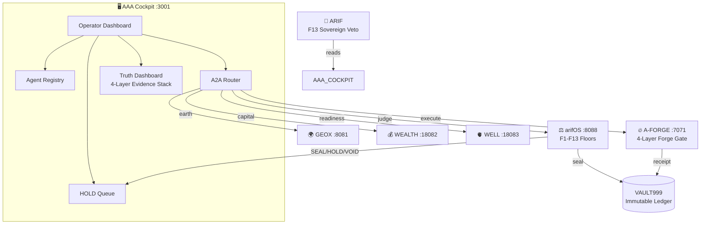

<!-- SOT-MANIFEST
federation_release: v2026.07.23
last_verified: 2026-07-23T22:00Z
live_commit: 523f240
truth_rule: /health + agent registry beat any static count in prose
a2a_port: 3001
a2a_status: healthy GREEN
vault: CONNECTED
seal_chain: append-only (chattr +a) + Merkle anchor every 100 receipts
qqq_version: v1.1.1 (10/10 tests pass)
protocol: A2A v1.0.0
gateway: Express 5.2.1 (a2a-server + a2a-gateway)
godel_lock: ACTIVE federation-wide
agent_lanes: 4 (333-AGI, 555-ASI, 888-APEX, 777-forge)
forge_instruments: 11 (grok-build, opencode, claude-code, qwen-code, antigravity, codex, copilot, aider, kimi-code, continue-cli, gemini-cli)
domain_organs: 6 (arifOS:8088, A-FORGE:7071, GEOX:8081, WEALTH:18082, WELL:18083, AAA:3001)
-->

# AAA — Federation State & Operator Cockpit

```
    █████╗  █████╗  █████╗
   ██╔══██╗██╔══██╗██╔══██╗
   ███████║███████║███████║
   ██╔══██║██╔══██║██╔══██║
   ██║  ██║██║  ██║██║  ██║
   ╚═╝  ╚═╝╚═╝  ╚═╝╚═╝  ╚═╝

   Alignment · Authority · Accountability
   ─────────────────────────────────────
   Federation Cockpit, Registry & Router
```

[](https://github.com/ariffazil/AAA/actions/workflows/agentic-ci.yml)
[](https://github.com/ariffazil/AAA/actions/workflows/aaa-governance.yml)
[](https://aaa.arif-fazil.com)
[](LICENSE)
[](https://github.com/ariffazil)

**Repository:** https://github.com/ariffazil/AAA
**Canonical identity:** `docs/FEDERATION_COCKPIT.md`  ·  **Genesis:** `GENESIS/AAA_MANDATE.md`
**Service:** `aaa-a2a.service` (systemd)  ·  **Live gateway:** `https://aaa.arif-fazil.com`

---

## TL;DR — Three Audiences

**For human operators (Arif):** AAA is the cockpit. It shows you every agent, every verdict, every seal. You read it. You don't configure it. [Jump to §10](#10-for-human-operators)

**For AI agents:** AAA is the A2A mesh hub. Register your agent card, declare capabilities, receive routing. Never judge, never execute. [Jump to §11](#11-for-ai-agents)

**For institutions:** AAA is the governed state — a constitutional substrate where 7 organs, 11 forge instruments, and 1 sovereign operate under F1–F13 law with full audit trace. [Jump to §12](#12-for-institutions)

---

## 0. What AAA Is (and Is Not)

AAA is the live state surface of the arifOS Federation. It registers agents, displays organ health, routes tasks, queues HOLDs, and shows verdicts.

> **AAA does not judge. AAA does not execute. AAA does not compute. AAA does not seal.**

### IS: The cockpit, registry, and router

| AAA IS | What this means |
|---------|-----------------|
| **The operator cockpit** | The surface Arif reads to understand the federation |
| **The agent registry** | Canonical registry of every agent, its card, its capabilities |
| **The A2A mesh hub** | Routes agent-to-agent tasks across all organs |
| **The truth dashboard** | Displays organ health, verdicts, and the four-layer evidence stack |
| **The approval queue** | Queues HOLDs for human review, displays SEAL/VOID verdicts |

### IS NOT: The judge, the executor, the constitution

| AAA IS NOT | Because this belongs to |
|-------------|------------------------|
| **The judge** | Constitutional verdicts (SEAL, HOLD, VOID) → `arifOS:8088` |
| **The executor** | Builds, deploys, forges → `A-FORGE:7071` |
| **The constitution** | F1–F13 floors → `arifOS` kernel |
| **A domain calculator** | Earth → GEOX · Capital → WEALTH · Vitality → WELL |
| **The sealed ledger** | VAULT999 → owned by arifOS; AAA displays, never writes |

> **arifOS judges. AAA routes and displays. A-FORGE executes. Domain organs witness. VAULT999 records. ARIF decides.**



### Federation Separation of Powers

| Layer | Role | Can | Cannot |
|-------|------|-----|--------|
| **ARIF** | Sovereign | Veto, approve, decide | Be overridden |
| **AAA** | State / Cockpit | Display, route, queue, register | Judge, execute, seal |
| **arifOS** | Judge | Issue SEAL/HOLD/VOID/SABAR | Execute mutations |
| **Domain Organs** | Witnesses | Compute and reflect evidence | Decide alone |
| **A-FORGE** | Executor | Build, deploy, mutate | Self-authorize |
| **VAULT999** | Ledger | Record immutable seals | Edit or delete history |

---

## 1. Federation Position

```
                              ┌──────────────────────┐
                              │    HUMAN SOVEREIGN    │
                              │   Arif bin Fazil      │
                              │   (F13 — final veto)  │
                              └──────────┬───────────┘
                                         │ reads cockpit
                                         ▼
┌─────────────────────────────────────────────────────────────────────────┐
│                                                                         │
│                          ┌─────────────────┐                            │
│                          │ AAA CONTROL PLANE│  ← YOU ARE HERE            │
│                          │ A2A gateway :3001│                            │
│                          └───────┬─────────┘                            │
│                                  │                                      │
│         ┌────────────────────────┼────────────────────────┐             │
│         │                        │                        │             │
│         ▼                        ▼                        ▼             │
│   ┌──────────┐            ┌──────────┐            ┌──────────┐          │
│   │  arifOS   │            │ A-FORGE  │            │  DOMAIN   │          │
│   │  JUDGES   │            │ EXECUTES │            │  ORGANS   │          │
│   │ F1-F13   │            │ builds,  │            │ GEOX     │          │
│   │ 888-APEX │            │ deploys, │            │ WEALTH   │          │
│   │ VAULT999 │            │ forges   │            │ WELL     │          │
│   │ Port 8088│            │ Port 7071│            │ 8081/18082/18083│   │
│   └──────────┘            └──────────┘            └──────────┘          │
│                                                                         │
└─────────────────────────────────────────────────────────────────────────┘
```

**Canonical flow:** Arif (F13) → AAA/Hermes (IDENTITY) → arifOS (GOVERNANCE) → Domain Organs (EVIDENCE) → A-FORGE (EXECUTE) → VAULT999 (SEAL)

---

## 2. The State — Who Lives Here

AAA is the governed state housing four layers of agents, organs, and instruments.

| Layer | Population | Location |
|-------|-----------|----------|
| **Sovereign** | Muhammad Arif bin Fazil (F13) | `agents/arif-fazil-identity.yaml` |
| **HEXAGON citizens** | 333-AGI · 555-ASI · 888-APEX | `agents/_lanes/{333-AGI,555-ASI,888-APEX}/` |
| **WITNESS** | 777-FORGE (session attestation) | `agents/_lanes/777-forge/` |
| **Runtime incarnations** | hermes-asi (Telegram @ASI_arifos_bot) · openclaw (:18789) | `agents/hermes-asi/`, `agents/openclaw/` |
| **Forge instruments** | grok-build · opencode · claude-code · qwen-code · antigravity · codex · copilot · aider · kimi-code · continue-cli · gemini-cli (11 total) | `a2a-server/agent-cards/forge/` |
| **Role agents** | EXTERNAL_WATCHER · KERNEL_SCRIBE · OPS_PLANNER · SELF_FORGE_ADVISOR | `agents/roles/` |
| **Domain organs** | arifOS · A-FORGE · GEOX · WEALTH · WELL · VAULT999 | 6 systemd services, 6 ports + immutable ledger |

> A-AUDIT and A-ARCHIVE were collapsed 2026-07-15 — now cross-cutting functions embedded in every organ, validated by 888-APEX. Legacy cards retained in `agents/_archive/`.

---

## 3. Quick Start

```bash
cd /root/AAA

# Install
npm install

# Dev server (React 19 + Vite 8)
npm run dev

# Build cockpit
npm run build

# Lint (ESLint 10)
npm run lint

# A2A gateway (standalone)
cd a2a-server && npm install && node server.js   # port 3001

# Validate contracts and registries
npm run validate:aaa

# A2A conformance test
npm run a2a:conformance

# Health check
curl -s http://localhost:3001/health | python3 -m json.tool
# → {"status":"healthy","protocol":"A2A","vault":"CONNECTED","gateway":"AAA"}
```

---

## 4. The Four-Layer Truth Stack

Every claim in the cockpit is tagged with its evidence layer. An agent cannot claim higher than its evidence supports.

```
GROUND_TRUTH    VAULT999 sealed      ← immutable, hash-chained
   ↑
VERIFIED_STATE  Live health probes   ← 300 s staleness
   ↑
CACHED_STATE    Memory, sessions     ← 3600 s staleness
   ↑
INFERRED        Agent reasoning      ← floor-bounded only
```

---

## 5. HEXAGON Agent Architecture

Four constitutional agents form the cognitive spine. Three are HEXAGON citizens; the fourth is WITNESS.

| Agent | Role | Authority | Active |
|-------|------|-----------|--------|
| **333-AGI** (Δ MIND) | General intelligence — reasoning, planning, exploration | Observe, Think, Plan | ✅ |
| **555-ASI** (Ω HEART) | Specialized intelligence — synthesis, critique, deep analysis | Critique, Synthesize, Audit | ✅ |
| **888-APEX** (ΦΙ JUDGE) | Constitutional adjudication — verdicts under F1–F13 | Judge, Seal (requires F13) | ✅ |
| **777-FORGE** | Session witness — spawn attestation, execution oversight | Witness, Attest | ✅ |

**Agent lifecycle:** `REGISTERED → PROBATION → ACTIVE → DEGRADED → RETIRED`

---

## 6. Deployment Surfaces

| Surface | URL | What it serves | Status |
|---------|-----|----------------|--------|
| **AAA A2A Gateway** | `https://aaa.arif-fazil.com` | `/health`, `/.well-known/*`, A2A routes, agent cards | ✅ Live |
| **Cockpit origin** | `http://127.0.0.1:3001` | Backend for the gateway — health, discovery, routing | ✅ Live |
| **Cockpit static build** | `dist/` (local) | React 19 SPA — built with `npm run build`, served via VPS | ✅ Builds |

---

## 7. The AREP Protocol

**AREP — Arif Reality Engineering Protocol.** Declare intent into a substrate that already knows who you are, what tools exist, and what's true.

```
HUMAN DECLARES INTENT
       │
       ▼
   DECLARE  →  VALIDATE  →  REALITY CHECK  →  ROUTE  →  EXECUTE  →  SEAL
```

| Pillar | Question |
|--------|----------|
| **A** — Affordance | What is the agent allowed and able to do? |
| **R** — Reality | What is actually true right now? |
| **E** — Epistemology | How do we separate truth classes? |
| **P** — Protocol | What are the rules? |

Full spec: `schemas/arep-task.schema.json` · `docs/AREP_PROTOCOL.md`

---

## 8. Architecture — What's on Disk

```
AAA/
├── src/                    # React 19 + TypeScript cockpit
│   ├── components/         # UI components (shadcn/ui + Radix)
│   ├── gateway/            # A2A gateway types, AREP types
│   └── lib/a2a/            # A2A client library
├── a2a-server/             # Express 5.2.1 A2A gateway (port 3001)
│   ├── server.js           # Main gateway server
│   ├── deliberation.ts     # 888-APEX deliberation engine
│   ├── seal_chain.js       # VAULT999 chain verification
│   └── agent-cards/         # Agent cards for all registered agents
├── agents/                 # Agent identities, lanes, registries
│   ├── _lanes/             # HEXAGON + WITNESS agent definitions
│   ├── hermes-asi/         # Telegram bot runtime
│   ├── openclaw/           # OpenClaw gateway (:18789)
│   ├── roles/              # Bounded role agents
│   ├── HEXAGON.yaml        # Constitutional topology
│   └── arif-fazil-identity.yaml  # Sovereign identity
├── registries/             # Canonical SOT registries
│   ├── agents.yaml         # Agent registry
│   ├── servers.yaml        # Server/org registry
│   ├── tools.yaml          # Tool capability registry
│   ├── workflows.yaml      # Workflow registry
│   └── hosts.yaml          # Host/node registry
├── schemas/                # JSON Schema contracts
├── GENESIS/                # Constitutional mandate + truth docs
├── governance/             # ADAT_AGENTIC, AAA_HUMAN_SPEECH_RULE, QQQ protocol
├── docs/                   # Federation documentation, architecture
├── public/a2a/             # Public A2A surface (agent cards, status)
├── .github/workflows/      # CI: agentic-ci, aaa-governance, pages (non-blocking)
└── skills/                 # Agent skills (AAA-tier catalog)
```

---

## 9. The Three Constitutions (GENESIS Chain)

| Doc | Anchors | Status |
|-----|---------|--------|
| **013** — `AAA_MANDATE.md` | *Display, never adjudicate. Route, never execute.* | Pending F13 ratification |
| **014** — `TRUTH_MD.md` | Truth as Haqq: Correspondence (F2) · Coherence (F2+F4) · Pragmatic (F3+F11) | SEALED 2026-06-20 |
| **015** — `DUAL_LANGUAGE.md` | Human civilisational (maruah, amanah, daulat) + machine constitutional (SEAL/HOLD/VOID) | SEALED 2026-06-20 |

> **Maruah without SEAL is just sentiment. SEAL without Maruah is just enforcement.** arifOS holds both.

---

## 10. For Human Operators (Arif)

**What you see:** The cockpit displays the governed state — agent health, verdict queue, seal chain, organ status.

**What you do:** Review HOLDs, acknowledge SEALs, veto irreversible actions (F13). You don't configure. You witness and decide.

**Key endpoints:**
- Cockpit: `https://aaa.arif-fazil.com`
- Health: `curl localhost:3001/health`
- Agent cards: `https://aaa.arif-fazil.com/.well-known/agent-card.json`

**The one rule:** Your veto is absolute. No agent can override F13.

---

## 11. For AI Agents

**Register:** Submit your agent card to `agents/` with identity, capabilities, and authority ceiling.

**Route:** AAA routes your task to the correct organ. You don't choose the organ — AAA does.

**Rules you must follow:**
1. AAA displays and routes — never judges, never executes
2. Constitutional verdicts go to `arif_judge` on arifOS:8088
3. Execution goes through `A-FORGE:7071` after a valid SEAL
4. Evidence comes from domain organs (GEOX, WEALTH, WELL) — not from you
5. All claims must carry epistemic labels: OBS, DER, INT, SPEC

**Agent card template:** See `public/a2a/agent-card.example.json`

---

## 12. For Institutions

AAA is the **governed state** — not a product, not a platform. It provides:

| Institutional property | How AAA delivers it |
|------------------------|---------------------|
| **Accountability** | Every verdict, route, and seal is logged and attributable (F11) |
| **Separation of powers** | Judge (arifOS) ≠ Executor (A-FORGE) ≠ Display (AAA) |
| **Immutable audit** | VAULT999 append-only hash chain — nothing can be deleted |
| **Human sovereignty** | F13 veto is absolute — no autonomous loop without human witness |
| **Domain grounding** | Every claim anchored to earth (GEOX), capital (WEALTH), or vitality (WELL) |
| **Constitutional floor** | F1–F13 enforced by arifOS kernel, not by permission gates |

---

## 13. The Invariant Chain

```
P2P          → how agents are connected
A2A          → how agents communicate
MCP tools    → how agents use capabilities
AAA-Cockpit  → displays governed state and routes tasks       ← THIS REPO
arifOS       → enforces F1–F13, adjudicates verdicts
A-FORGE      → executes mutations after valid SEALs
VAULT999     → seals final audit artifacts
Arif         → F13 sovereign — final authority
```

---

## 14. Build, Test, Deploy

```bash
# Standard CI lane
npm install && npm run lint && npm run build

# A2A Conformance
npm run a2a:conformance

# Validate registries
npm run validate:aaa

# Deploy (T2 — announce 10s)
systemctl restart aaa-a2a.service
curl -s http://localhost:3001/health | python3 -m json.tool
```

---

## 15. Federation Cross-Reference

| Organ | Role | Port | Repo |
|-------|------|------|------|
| **arifOS** | Constitutional kernel | 8088 | [ariffazil/arifos](https://github.com/ariffazil/arifos) |
| **A-FORGE** | Execution shell | 7071 | [ariffazil/A-FORGE](https://github.com/ariffazil/A-FORGE) |
| **GEOX** | Earth intelligence | 8081 | [ariffazil/geox](https://github.com/ariffazil/geox) |
| **WEALTH** | Capital intelligence | 18082 | [ariffazil/wealth](https://github.com/ariffazil/wealth) |
| **WELL** | Vitality guard | 18083 | [ariffazil/well](https://github.com/ariffazil/well) |
| **HERMES** | Multi-modal bridge + Telegram relay | 8644 | [ariffazil/HERMES](https://github.com/ariffazil/HERMES) |
| **AAA** | State + cockpit | 3001 | ← you are here |

---

## 16. Protocol Connection

AAA uses **A2A (Agent-to-Agent)**, not direct MCP:

| Property | Value |
|----------|-------|
| **A2A Endpoint** | `https://aaa.arif-fazil.com/a2a/` |
| **Agent Card** | `https://aaa.arif-fazil.com/.well-known/agent-card.json` |
| **Health** | `https://aaa.arif-fazil.com/health` |

For MCP access, use the federation gateway: `https://mcp.arif-fazil.com/mcp` (arifOS → A-FORGE proxy)

---

## 17. Quick Reference

```
┌──────────────────────────────────────────────────────────────────┐
│  AAA — THE GOVERNED STATE OF THE arifOS FEDERATION              │
├──────────────────────────────────────────────────────────────────┤
│  Port:        3001 (A2A gateway)                                 │
│  Frontend:    React 19 + TypeScript 6 + Vite 8 + Tailwind 4     │
│  Backend:     Express 5.2.1 (a2a-server)                        │
│  UI:          shadcn/ui (Radix primitives)                       │
│                                                                  │
│  HEXAGON:     333-AGI · 555-ASI · 888-APEX                      │
│  WITNESS:     777-FORGE (session attestation)                    │
│  Runtime:     hermes-asi (Telegram) · openclaw (:18789)         │
│  Forge:       11 instruments (grok-build → gemini-cli)           │
│  Organs:      6 systemd services + VAULT999 ledger               │
│                                                                  │
│  OWNS:        Display · Route · Queue · Register                 │
│  NEVER:       Judge · Execute · Seal · Compute                  │
│                                                                  │
│  Dev:         npm run dev                                        │
│  Build:       npm run build                                      │
│  Deploy:      systemctl restart aaa-a2a.service                  │
│  Health:      curl localhost:3001/health                         │
│  SOT files:   registries/ + agents/ + GENESIS/                   │
└──────────────────────────────────────────────────────────────────┘
```

---

```
    ┌──────────────────────────────────────────────────┐
    │                                                  │
    │   AAA is the state.                             │
    │   arifOS is the judge.                          │
    │   A-FORGE is the executor.                      │
    │   The organs are the witnesses.                 │
    │   The cockpit is the window.                    │
    │   Arif is the sovereign.                        │
    │                                                  │
    │   The window is not the wall.                   │
    │   The state is not the constitution.            │
    │   The display is not the verdict.               │
    │   The route is not the action.                  │
    │   The queue is not the seal.                    │
    │   The registry is not the law.                  │
    │                                                  │
    │   Maruah without SEAL is sentiment.             │
    │   SEAL without Maruah is enforcement.           │
    │                                                  │
    │   DITEMPA BUKAN DIBERI                         │
    │   The state is forged, not given.               │
    │   999 SEAL ALIVE.                               │
    │                                                  │
    └──────────────────────────────────────────────────┘
```
