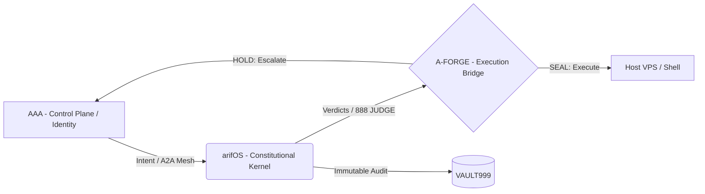

<!-- SOT-MANIFEST
owner: Arif
last_verified: 2026-05-23
valid_from: 2026-05-23
valid_until: 2026-06-23
confidence: high
scope: /root/AAA
epistemic_status: CLAIM
-->

# AAA — Agent Interface & Session Cockpit

> **Status:** OPERATIONAL (Current L3 State) | **Organ:** BODY (Ψ) | **Authority:** arifOS
> **Target State:** [AAA² Agent-Agnostic Plane](./docs/architecture/AAA2_Kernel_UAA_PSP_v2026.05.md)

---

## 🏛️ What this repo IS
The primary interface surface for agentic sessions within the federation. AAA owns the **BODY**—the observable surface and identity plane.
- The **React Cockpit UI** for the 888 Human (Arif).
- The **Identity Source of Truth** (`ARIF.md`, `SOUL.md`).
- The **A2A Gateway** for agent-to-agent communication.

## 🚫 What this repo is NOT
- **Constitutional Law Kernel:** That is [arifOS](../arifOS).
- **Execution Engine:** That is [A-FORGE](../A-FORGE).

*Important:* We are the interface and registry. We do not judge law, nor do we run workloads.

---

## 🔄 Federation Loop

---

## 🗺️ Canonical Repo Contents

- **`src/`**: React 19 Cockpit UI and A2A Gateway.
- **`seed/`**: Control-plane identity seed data (The exclusive home of `ARIF.md` and `SOUL.md`).
- **`docs/architecture/`**: Future state roadmaps, notably AAA².
- **`docs/philosophy/`**: Eureka insights and boundary definitions previously stored at root.

### 📌 The AAA² Target State
*Currently, AAA maps native agent interfaces manually (e.g., `openclaw/`, `hermes-*/`). The AAA² roadmap will replace the centralized A2A gateway with a Federation Mesh (FMesh) and universal capability negotiation.*

---
*Last Verified: 2026-05-23 | 999 SEAL ALIVE*
