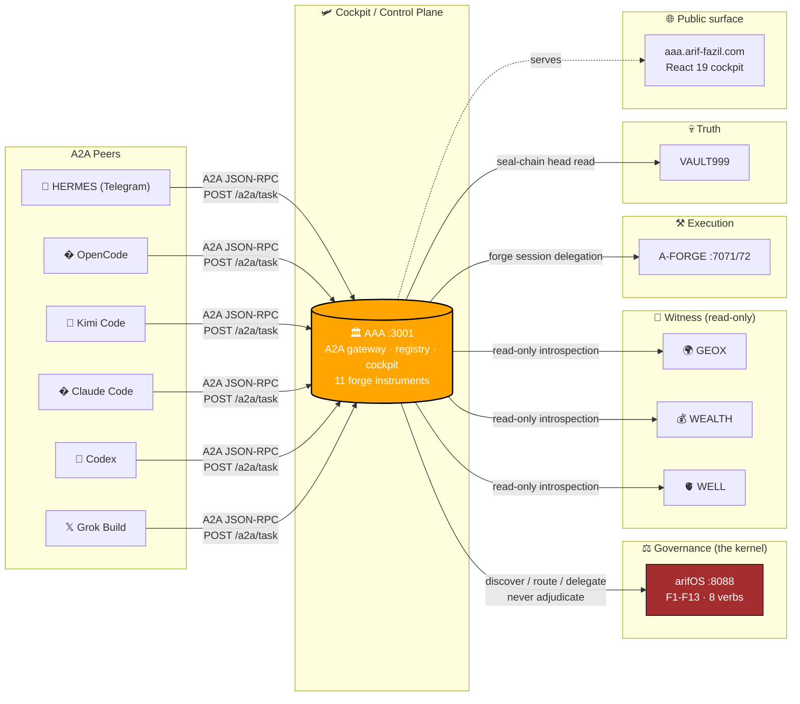

<!-- SOT-MANIFEST
federation_release: v2026.08.09
last_verified: 2026-08-11T05:58:51Z
live_commit: d2053cba (fed: route_health DEAD propagation on providers insolvency)
truth_rule: /health + agent registry beat any static count in prose
a2a_port: 3001
a2a_status: healthy GREEN (deployment_drift: false)
public_surface_status: aaa.arif-fazil.com/ returns 200 (React SPA serving from /var/www/html/aaa/, deployed 2026-08-11)
vault: CONNECTED
seal_chain: append-only (chattr +a) + Merkle anchor every 100 receipts
qqq_version: v1.1.1 (10/10 tests pass)
protocol: A2A v1.0.0
gateway: Express 5.2.1 (a2a-server + a2a-gateway)
godel_lock: ACTIVE federation-wide
agent_lanes: 4 (333-AGI, 555-ASI, 888-APEX, 777-FORGE)
forge_instruments: 11 (opencode, grok-build, claude-code, kimi-code, codex, copilot, aider, qwen-code, antigravity, continue-cli, gemini-cli)
domain_organs: 6 (arifOS:8088, A-FORGE:7071, GEOX:8081, WEALTH:18082, WELL:18083, AAA:3001)
infra_organs: 4 (arifFlow:7073 METABOLISM, FED:7074 ADVISORY, FLAME:18901 ADVISORY, FRAME:frame-organ.service OBSERVE)
audit_basis: 333-AGI Δ MIND session (2026-08-11) — 19-repo README audit
-->

# 🏛️ AAA — Agentic Intelligence Institution & A2A Control Plane

[](https://github.com/ariffazil/AAA/actions)
[](https://github.com/ariffazil/AAA/actions)
[](https://aaa.arif-fazil.com)
[](https://arifos.arif-fazil.com)
[](./LICENSE)

> **AAA is the institution. It routes and displays. It never judges.**
> **DITEMPA BUKAN DIBERI — The state is forged, not given.**

**AAA (Alignment, Authority, Accountability)** is the institutional control plane of the arifOS Federation. It operates the A2A (Agent-to-Agent) Mesh Gateway, the agent identity registry, the task router, and the operator cockpit — connecting **11 forge instruments**, **6 domain organs**, and the sovereign human operator under a unified protocol.

---


## Institutional density (2026-08-09)

Hermes / federation are evolving as **anti-chaos infrastructure**, not agent thrash.

| Doc | Role |
|-----|------|
| `governance/HOLY8_FOUR_LAYER_LANGUAGE.md` | Observation / Interpretation / Constraint / Action |
| `governance/HERMES_DNA.md` | ECHO·SCAR·ATLAS·MAP topology + Dark Mirror |
| `governance/DOUBLE_HELIX_ECHO_SCAR.md` | Dual continuity strands |
| `governance/INSTITUTIONAL_COMPRESSION.md` | Ambiguity reduction + freeze |
| `governance/AGENTIC_INSTITUTION_PARADOXES.md` | MAP·ATLAS·ECHO doctrine |

Telemetry (observe-only freeze): `map-atlas-echo` · Kabarkan → PG · cron 6h.

## 🧬 Agent · Skill · Tool · Organ — The Entity Ontology

```
+-------------------------------------------------------------------------+
|                               AGENTS                                    |
| (Autonomous Citizens with Identity, Authority & Intent State)           |
|  333-AGI · 555-ASI · 888-APEX · opencode (FI-001)                       |
+------------------------------------+------------------------------------+
                                     | Executes
                                     v
+-------------------------------------------------------------------------+
|                                SKILLS                                   |
| (Domain Knowledge Workflows & Epistemic Procedures)                     |
|  AGI-explorer-intelligence · FORGE-infra-guardian                       |
+------------------------------------+------------------------------------+
                                     | Invokes
                                     v
+-------------------------------------------------------------------------+
|                                TOOLS                                    |
| (Deterministic Execution Primitives via MCP or Shell)                   |
|  arif_observe · geox_petrophysics · forge_git                           |
+------------------------------------+------------------------------------+
                                     | Hosted On
                                     v
+-------------------------------------------------------------------------+
|                                ORGANS                                   |
| (Microservice Infrastructure Bounds — systemd daemons)                  |
|  arifOS (:8088) · A-FORGE (:7071) · GEOX (:8081) · AAA (:3001)         |
+-------------------------------------------------------------------------+
```

---

## 🌐 A2A Mesh vs. MCP Surface

| Dimension | A2A (AAA Gateway :3001) | MCP (arifOS Kernel :8088) |
|:---|:---|:---|
| **Focus** | Agent � Agent coordination | Agent ↔ Tool invocation |

---

## 🗺️ Where AAA Sits in the Federation


```mermaid
flowchart LR
  subgraph Cockpit["🛩️ Cockpit / Control Plane"]
    AAA[("🏛️ AAA :3001<br/>A2A gateway · registry · cockpit<br/>11 forge instruments")]
  end

  subgraph Peers["A2A Peers"]
    HERMES["🔮 HERMES (Telegram)"]
    OPENCODE["� OpenCode"]
    KIMI["🐙 Kimi Code"]
    CLAUDE["� Claude Code"]
    CODEX["📘 Codex"]
    GROK["𝕏 Grok Build"]
  end

  subgraph Governance["⚖️ Governance (the kernel)"]
    ARIFOS["arifOS :8088<br/>F1-F13 · 8 verbs"]
  end

  subgraph Witness["🔬 Witness (read-only)"]
    GEOX["🌍 GEOX"]
    WEALTH["💰 WEALTH"]
    WELL["🫀 WELL"]
  end

  subgraph Execution["⚒️ Execution"]
    AFORGE["A-FORGE :7071/72"]
  end

  subgraph Truth["💀 Truth"]
    VAULT["VAULT999"]
  end

  subgraph Public["🌐 Public surface"]
    AAAWEB["aaa.arif-fazil.com<br/>React 19 cockpit"]
  end

  HERMES & OPENCODE & KIMI & CLAUDE & CODEX & GROK -->|"A2A JSON-RPC<br/>POST /a2a/task"| AAA

  AAA -->|"discover / route / delegate<br/>never adjudicate"| ARIFOS
  AAA -->|"read-only introspection"| GEOX & WEALTH & WELL
  AAA -->|"forge session delegation"| AFORGE
  AAA -->|"seal-chain head read"| VAULT

  AAA -.->|"serves"| AAAWEB

  classDef cockpit fill:#FFA500,stroke:#000,color:#fff,stroke-width:2px
  classDef peer fill:#e0e0e0,stroke:#000
  classDef governance fill:#A42E2E,stroke:#000,color:#fff
  classDef witness fill:#4285F4,stroke:#000,color:#fff
  classDef execution fill:#2E7D32,stroke:#000,color:#fff
  classDef truth fill:#000,stroke:#000,color:#fff
  class AAA cockpit
  class ARIFOS governance
```

**AAA internal loop (A2A gateway):**

```
incoming A2A request (POST /a2a/task)
        │
        ▼
agent identity verification (Ed25519 + SCT)
        │
        ▼
discover organ (arifos / forge / geox / wealth / well / hermes / openclaw)
        │
        ▼
route + delegate to organ (no adjudication — pure dispatch)
        │
        ▼
collect response · seal-chain head read
        │
        ▼
return A2A response to peer
        │
        ▼
emit audit receipt (AAA → arifOS → VAULT999)
```

**Hard rules (DISPLAY_ONLY ceiling):**
- AAA never adjudicates. It routes to arifOS for F1-F13 verdicts.
- AAA never executes. It delegates to A-FORGE under SEAL.
- AAA never self-issues SEAL/HOLD/VOID. AAA prepares handoff envelopes; arifOS renders verdicts.

---

## 🏅 Federation Certification

[](https://aaa.arif-fazil.com/health)
[](https://arif-fazil.com/999/verify)
[](https://github.com/ariffazil/arifos/blob/main/GENESIS/000_KERNEL_CANON.md)

[](https://github.com/ariffazil/arifos/blob/main/FEDERATION_CONTRACT.md)
[](https://github.com/ariffazil/arifos/blob/main/FEDERATION_CONTRACT.md)
[](https://github.com/ariffazil/AAA/blob/main/FEDERATION.md)

[](https://github.com/ariffazil/AAA)
[](https://github.com/ariffazil/AAA)
[](https://github.com/ariffazil/AAA)
[](https://github.com/ariffazil/AAA/blob/main/LICENSE)

[](https://github.com/ariffazil/AAA/actions/workflows/aaa-governance.yml)
[](https://github.com/ariffazil/AAA/actions/workflows/agentic-ci.yml)


| **Protocol** | Async JSON-RPC · Agent Cards · Task Delegation | Sync JSON-RPC 2.0 · FastMCP |
| **State** | Persistent AREP tasks, long-running threads | Synchronous request-response |
| **Governance** | Task routing, role mapping, agent registry | F1–F13 floor checking, 888_HOLD gates |

---

## 🛰️ Operator Cockpit

AAA provides a React 19 + Vite 8 cockpit displaying real-time federation health, agent status, and pending `888_HOLD` decisions.

```
Public Gateway:  https://aaa.arif-fazil.com
Local Gateway:   http://127.0.0.1:3001
Agent Card:      https://aaa.arif-fazil.com/.well-known/agent-card.json
```

```bash
curl -s http://127.0.0.1:3001/health | jq .     # Health & drift
cd /root/AAA && npm run build                     # Rebuild
npm run a2a:conformance                           # Validate A2A suite
```

---

## 🏛️ Federation Navigation

| Organ | Role | Port | Repo | MCP | Health | LLMs |
|:---|:---|:---:|:---|:---|:---|:---|
| **⚖️ arifOS** | Constitutional Kernel — judges, seals | 8088 | [repo](https://github.com/ariffazil/arifos) | [mcp](https://mcp.arif-fazil.com/mcp) | [health](https://arifos.arif-fazil.com/health) | [llms.txt](https://arifos.arif-fazil.com/llms.txt) |
| **⚒️ A-FORGE** | Execution Engine — builds, deploys | 7071/72 | [repo](https://github.com/ariffazil/A-FORGE) | [mcp](https://forge.arif-fazil.com/mcp) | [health](https://forge.arif-fazil.com/health) | [llms.txt](https://forge.arif-fazil.com/llms.txt) |
| **🏛️ AAA** | Control Plane — A2A gateway, cockpit | 3001 | [repo](https://github.com/ariffazil/AAA) | — | [health](https://aaa.arif-fazil.com/health) | [llms.txt](https://aaa.arif-fazil.com/llms.txt) |
| **🌍 GEOX** | Earth Intelligence — seismic, wells | 8081 | [repo](https://github.com/ariffazil/GEOX) | [mcp](https://geox.arif-fazil.com/mcp) | [health](https://geox.arif-fazil.com/health) | [llms.txt](https://geox.arif-fazil.com/llms.txt) |
| **💰 WEALTH** | Capital Intelligence — NPV, risk | 18082 | [repo](https://github.com/ariffazil/WEALTH) | [mcp](https://wealth.arif-fazil.com/mcp) | [health](https://wealth.arif-fazil.com/health) | (llms.txt pending) |
| **🫀 WELL** | Vitality Guard — human readiness | 18083 | [repo](https://github.com/ariffazil/WELL) | [mcp](https://well.arif-fazil.com/mcp) | [health](https://well.arif-fazil.com/health) | [llms.txt](https://well.arif-fazil.com/llms.txt) |
| **🫀 arifFlow** | Metabolism — FQ pulse, receipts | 7073 | [repo](https://github.com/ariffazil/arifFlow) | — | [health](https://arifflow.arif-fazil.com/health) | — |
| **🧭 FED** | Route Advisor — model/provider ranking | 7074 | private (internal) | — | [health](https://fed.arif-fazil.com/health) | — |
| **🔥 FLAME** | RM0 Inference — free-loop model mesh | 18901 | private (internal) | — | [health](https://flame.arif-fazil.com/health) | — |
| **� FRAME** | Substrate — federation scaffolding | frame-organ.service | private (internal) | — | — | — |
| **🔮 HERMES** | Multi-Modal Bridge — Telegram relay | 8644 | [repo](https://github.com/ariffazil/HERMES) | — | — | — |
| **🌐 arif-fazil.com** | Public Web Surface — one domain | 443 | [repo](https://github.com/ariffazil/arif-fazil.com) | — | [verify](https://arif-fazil.com/999/verify) | — |
| **💀 VAULT999** | Immutable Seal — append-only receipt chain | fs | [verify](https://arif-fazil.com/999/verify) | — | [verify](https://arifos.arif-fazil.com/health) | — |

---

## 📡 Federation Registries

AAA operates the A2A (Agent-to-Agent) mesh — discovery metadata is exposed at the standard agent card endpoints.

| Registry | Manifest |
|----------|----------|
| **A2A v1.0** | `GET https://aaa.arif-fazil.com/.well-known/agent.json` — base agent card |
| **A2A v2.x** | `GET https://aaa.arif-fazil.com/.well-known/agent-card.json` — extended card (authenticated) |
| **Federation Discovery** | `GET https://arifos.arif-fazil.com/.well-known/agent-card.json` — all 11 forge instruments |

Federation surface: [aaa.arif-fazil.com](https://aaa.arif-fazil.com) · Health: `GET https://aaa.arif-fazil.com/health`

---

## � Sovereignty & License

- **License:** GNU Affero General Public License v3.0 (**AGPL-3.0**)
- **Sovereign:** **Muhammad Arif bin Fazil** (F13 SOVEREIGN). AAA is the institutional window for sovereign oversight.

> *DITEMPA BUKAN DIBERI — Forged, Not Given.*  
> *Maruah without SEAL is sentiment. SEAL without Maruah is enforcement. 999 SEAL ALIVE.*

---

## 🛡️ CI Governance (F13 verdict 2026-08-10)

This repo follows the federation's CI governance pattern (replicated from `ariffazil/arifOS` PR #683). The pattern ensures Dependabot PRs receive a real, reproducible unprivileged verdict — no more all-red check rolls from structurally-incompatible gates.

**Per-repo adapter** (see `.github/workflows/` for the actual files):

- `.github/dependabot.yml` — `uv` (Python) / `cargo` (Rust) / `npm` (TypeScript) ecosystem; cooldown 3d; open-PRs 5; constitutional packages un-grouped (no `ignore:` — visibility preserved)
- `.github/workflows/dependabot-ci.yml` — unprivileged gate; runs ONLY on Dependabot PRs; SHA-bound probes
- `.github/workflows/{ci-uv-lock-invariant|cargo-lock-invariant|npm-lock-invariant}.yml` — universal `{uv lock --check && uv sync --frozen | cargo check --locked && cargo build --locked | npm ci}` invariant on every PR + push to main
- `.github/workflows/auto-merge-dependabot.yml` — constitutional package denylist (per-language); F13 review the only merge path
- Privileged workflows gated with `if: github.actor != 'dependabot[bot]' && github.actor != 'app/dependabot'` — so they SKIP for Dependabot PRs where their inputs cannot be satisfied

**Constitutional packages** (denied auto-merge, require F13 review):

| Language | Denylist |
|---|---|
| Python | `protobuf`, `cryptography`, `fastmcp-slim`, `fastmcp`, `caio`, `sentence-transformers`, `pynacl`, `blake3` |
| Rust    | `serde`, `tokio`, `hyper`, `axum`, `reqwest`, `rustls`, `async-trait`, `clap`, `tracing` |
| TypeScript | `zod`, `@modelcontextprotocol/sdk`, `fastmcp`, `mcp-sdk`, `tsx`, `vitest`, `@types/node`, `typescript`, `ts-node` |
| Static site | `vite`, `react`, `react-dom`, `react-router`, `@tanstack/react-query`, `tailwindcss` |

**Reference:** [`/root/AGENTS.md`](/root/AGENTS.md) — canonical federation doctrine. `AAA/docs/ORGAN.md` — topology.

DITEMPA BUKAN DIBERI — governance is forged, not given.
