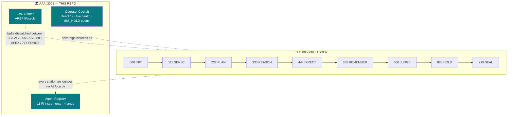

<!-- SOT-MANIFEST
federation_release: v2026.08.15
last_verified: 2026-08-15T16:30:00Z
live_commit: e34c34ad (docs(state): FI-003 landed + nav zen enforcer + repos sync 2026-08-14)
actor_surface_doctrine: RATIFIED 2026-08-15 (resit 09db16ec) — actors invariant, surfaces replaceable, models runtime occupants; RCR falsifier live (next model release = 1 SOT edit or geometry fails)
qwen_code: FI-003 on glm-5.3 (runtime-resolved via model_binding → federation-models.json; card de-static'd v2.2.1)
glm_shadow: SHADOW-GLM-004 silent_version_redirect HIGH (Z.ai coding plan glm-5.2→5.3 verified live; [1m] suffix is Anthropic-endpoint-only)
truth_rule: /health + agent registry beat any static count in prose
a2a_port: 3001
a2a_status: healthy GREEN (deployment_drift: false)
vault: CONNECTED
seal_chain: append-only (chattr +a) + Merkle anchor every 100 receipts
qqq_version: v1.1.1 (10/10 tests pass)
protocol: A2A v1.0.0
gateway: Express 5.2.1 (a2a-server + a2a-gateway)
godel_lock: ACTIVE federation-wide
agent_lanes: 4 (333-AGI, 555-ASI, 888-APEX, 777-FORGE)
forge_instruments: 11 (opencode, grok-build, claude-code, kimi-code, codex, copilot, aider, qwen-code, antigravity, continue-cli, gemini-cli)
domain_organs: 7 (arifOS:8088, A-FORGE:7071/72, GEOX:8081, WEALTH:18082, WELL:18083, AAA:3001, arifFlow:7073)
kernel_alignment: source=built=deployed=a302c2f (attestation aligned 2026-08-14)
-->

# 🏛️ AAA — Agentic Intelligence Institution & A2A Control Plane

[](https://github.com/ariffazil/AAA/actions)
[](https://github.com/ariffazil/AAA/actions)
[](https://aaa.arif-fazil.com)
[](#-a2a-mesh-vs-mcp-surface)
[](#-federation-registries)
[](#-agent--skill--tool--organ--the-entity-ontology)
[](#-the-canonical-ladder-000999--aaa-routes-it-never-judges)
[](https://arifos.arif-fazil.com)
[](./LICENSE)

> **AAA is the institution. It routes and displays. It never judges.**
> **DITEMPA BUKAN DIBERI — The state is forged, not given.**

<!-- RULE-5 First Fold -->
> **What?** Institutional control plane — connecting forge instruments, domain organs, and the sovereign human operator.
> **Why?** Coordination without a control plane is chaos; AAA is the nervous system.
> **Care?** For humans — one cockpit to watch the whole institution. For agents — register your card, declare your lane.

**AAA (Agents, API, AI, Apps)** is the institutional control plane of the arifOS Federation. It operates the A2A (Agent-to-Agent) Mesh Gateway, the agent identity registry, the task router, and the operator cockpit — connecting **11 forge instruments**, **7 domain organs**, and the sovereign human operator under a unified protocol. *AAA also embodies Alignment, Authority, and Accountability — the governance principles behind every routing decision.*

**For humans:** one cockpit to watch the whole institution — organ health, agent lanes, pending 888_HOLD decisions.
**For agents:** register your card, declare your lane, receive routed tasks. AAA moves messages; it never moves authority.

---

## 🔢 The Canonical Ladder 000–999 — AAA routes it, never judges it

AAA sits **beside** the ladder, not on it. It is the switchboard every station speaks through — with zero adjudication power of its own.


```mermaid
flowchart TB
    subgraph Ladder["THE 000-999 LADDER"]
        direction LR
        S000["000 INIT"] --> S111["111 SENSE"] --> S222["222 PLAN"] --> S333["333 REASON"]
        S333 --> S444["444 DIRECT"] --> S555["555 REMEMBER"] --> S666["666 JUDGE"]
        S666 --> S888["888 HOLD"] --> S999["999 SEAL"]
    end
    subgraph AAAPlane["🏛️ AAA :3001 — THIS REPO"]
        REG["Agent Registry<br/>11 FI instruments · 4 lanes"]
        ROUTE2["Task Router<br/>AREP lifecycle"]
        COCK["Operator Cockpit<br/>React 19 · live health · 888_HOLD queue"]
    end
    Ladder -.->|"every station announces<br/>via A2A cards"| REG
    ROUTE2 -.->|"tasks dispatched between<br/>333-AGI / 555-ASI / 888-APEX / 777-FORGE"| Ladder
    COCK -.->|"sovereign watches all"| Ladder
    style REG fill:#0a7b83,color:#fff
    style ROUTE2 fill:#0a7b83,color:#fff
    style COCK fill:#0a7b83,color:#fff
```

| Station | AAA's role |
|---|---|
| 000–555 (cognition) | Carries agent cards & task messages between lanes — content-blind |
| 666 (judge) | **Displays** the 888_HOLD queue for sovereign ratification — never adjudicates |
| 777 (forge) | Routes execution tasks to FI instruments; never executes itself |
| 888 (hold) | Verdict class: `888_HOLD` = human approval gate (F13 territory) |
| 999 (seal) | Surfaces VAULT999 chain status on the cockpit — never appends |

**The Gödel Lock at AAA:** routing power ≠ judgment power. A switchboard that could judge would be a shadow court. AAA structurally cannot.

---

## 🧬 Agent · Skill · Tool · Organ — The Entity Ontology

```
+-------------------------------------------------------------------------+
|                               AGENTS                                    |
| (Autonomous Citizens with Identity, Authority & Intent State)           |
|  333-AGI · 555-ASI · 888-APEX · opencode (FI-001) · ... 11 FIs          |
+------------------------------------+------------------------------------+
                                     | Executes
                                     v
+-------------------------------------------------------------------------+
|                                SKILLS                                   |
| (Domain Knowledge Workflows & Epistemic Procedures)                     |
|  AGI-explorer-intelligence · FORGE-infra-guardian                       |
+------------------------------------+------------------------------------+
                                     | Invokes
                                     v
+-------------------------------------------------------------------------+
|                                TOOLS                                    |
| (Deterministic Execution Primitives via MCP or Shell)                   |
|  arif_observe · geox_petrophysics · forge_git                           |
+------------------------------------+------------------------------------+
                                     | Hosted On
                                     v
+-------------------------------------------------------------------------+
|                                ORGANS                                   |
| (Microservice Infrastructure Bounds — systemd daemons)                  |
|  arifOS (:8088) · A-FORGE (:7071/72) · GEOX (:8081) · AAA (:3001)       |
+-------------------------------------------------------------------------+
```

### ASCII — AAA in the federation at a glance

```
                          ┌──────────────────────────┐
                          │ 👑 ARIF (F13 SOVEREIGN)  │
                          └────────────┬─────────────┘
                        watches · vetoes · ratifies
                                       │
   ┌───────────────────────────────────▼────────────────────────────────┐
   │              🏛️ AAA :3001 — A2A MESH GATEWAY (this repo)           │
   │   agent cards · task router · operator cockpit · 888_HOLD queue    │
   └──┬───────────┬───────────┬───────────┬───────────┬───────────┬─────┘
      │           │           │           │           │           │
      ▼           ▼           ▼           ▼           ▼           ▼
  ⚖️ arifOS   ⚒️ A-FORGE   🌍 GEOX    💰 WEALTH   🫀 WELL    🧠 arifFlow
   :8088      :7071/72     :8081      :18082      :18083      :7073
   judges     executes     earth      capital    vitality    FQ pulse
      ▲           ▲                                               │
      └───────────┴───────── 11 FI INSTRUMENTS (333-AGI lane) ─────┘
        opencode · grok-build · claude-code · kimi-code · codex
        copilot · aider · qwen-code · antigravity · continue-cli · gemini-cli
```

---

## 🌐 A2A Mesh vs. MCP Surface

| Dimension | A2A (AAA Gateway :3001) | MCP (arifOS Kernel :8088) |
|:---|:---|:---|
| **Focus** | Agent ↔ Agent coordination | Agent ↔ Tool invocation |
| **Protocol** | Async JSON-RPC · Agent Cards · Task Delegation | Sync JSON-RPC 2.0 · FastMCP |
| **State** | Persistent AREP tasks, long-running threads | Synchronous request-response |
| **Governance** | Task routing, role mapping, agent registry | F1–F13 floor checking, 888_HOLD gates |

---

## 🛰️ Operator Cockpit

AAA provides a React 19 + Vite 8 cockpit displaying real-time federation health, agent status, and pending `888_HOLD` decisions.

```
Public Gateway:  https://aaa.arif-fazil.com
Local Gateway:   http://127.0.0.1:3001
Agent Card:      https://aaa.arif-fazil.com/.well-known/agent-card.json
```

```bash
curl -s http://127.0.0.1:3001/health | jq .     # Health & drift
cd /root/AAA && npm run build                     # Rebuild
npm run a2a:conformance                           # Validate A2A suite
```

---

## Institutional density (2026-08-09)

Hermes / federation are evolving as **anti-chaos infrastructure**, not agent thrash.

| Doc | Role |
|-----|------|
| `governance/HOLY8_FOUR_LAYER_LANGUAGE.md` | Observation / Interpretation / Constraint / Action |
| `governance/HERMES_DNA.md` | ECHO·SCAR·ATLAS·MAP topology + Dark Mirror |
| `governance/DOUBLE_HELIX_ECHO_SCAR.md` | Dual continuity strands |
| `governance/INSTITUTIONAL_COMPRESSION.md` | Ambiguity reduction + freeze |
| `governance/AGENTIC_INSTITUTION_PARADOXES.md` | MAP·ATLAS·ECHO doctrine |

Telemetry (observe-only freeze): `map-atlas-echo` · Kabarkan → PG · cron 6h.

---

## 🏛️ Federation Navigation

| Organ | Role | Port | Repo | MCP | Health | LLMs |
|:---|:---|:---:|:---|:---|:---|:---|
| **⚖️ arifOS** | Constitutional Kernel — judges, seals | 8088 | [repo](https://github.com/ariffazil/arifos) | [mcp](https://mcp.arif-fazil.com/mcp) | [health](https://arifos.arif-fazil.com/health) | [llms.txt](https://arifos.arif-fazil.com/llms.txt) |
| **⚒️ A-FORGE** | Execution Engine — builds, deploys | 7071/72 | [repo](https://github.com/ariffazil/A-FORGE) | [mcp](https://forge.arif-fazil.com/mcp) | [health](https://forge.arif-fazil.com/health) | [llms.txt](https://forge.arif-fazil.com/llms.txt) |
| **🏛️ AAA** | Control Plane — A2A gateway, cockpit | 3001 | [repo](https://github.com/ariffazil/AAA) | — | [health](https://aaa.arif-fazil.com/health) | [llms.txt](https://aaa.arif-fazil.com/llms.txt) |
| **🌍 GEOX** | Earth Intelligence — seismic, wells | 8081 | [repo](https://github.com/ariffazil/GEOX) | [mcp](https://geox.arif-fazil.com/mcp) | [health](https://geox.arif-fazil.com/health) | [llms.txt](https://geox.arif-fazil.com/llms.txt) |
| **💰 WEALTH** | Capital Intelligence — NPV, risk | 18082 | [repo](https://github.com/ariffazil/WEALTH) | [mcp](https://wealth.arif-fazil.com/mcp) | [health](https://wealth.arif-fazil.com/health) | [llms.txt](https://wealth.arif-fazil.com/llms.txt) |
| **🫀 WELL** | Vitality Guard — human readiness | 18083 | [repo](https://github.com/ariffazil/WELL) | [mcp](https://well.arif-fazil.com/mcp) | [health](https://well.arif-fazil.com/health) | [llms.txt](https://well.arif-fazil.com/llms.txt) |
| **🔮 HERMES** | Multi-Modal Bridge — Telegram relay | 8644 | [repo](https://github.com/ariffazil/HERMES) | — | — | — |
| **🧠 arifFlow** | FQ Metabolic Pulse — session metabolism | 7073 | [repo](https://github.com/ariffazil/arifFlow) | — | [health](http://127.0.0.1:7073/health) | — |
| **🌐 arif-fazil.com** | Public Web Surface — one domain | 443 | [repo](https://github.com/ariffazil/arif-fazil.com) | — | [verify](https://arif-fazil.com/999/verify) | — |
| **💀 VAULT999** | Immutable Seal — append-only receipt chain | fs | [repo](https://github.com/ariffazil/arifOS) | — | [verify](https://arifos.arif-fazil.com/health) | — |

---

## 📡 Federation Registries

AAA operates the A2A (Agent-to-Agent) mesh — discovery metadata is exposed at the standard agent card endpoints.

| Registry | Manifest |
|----------|----------|
| **A2A v1.0** | `GET https://aaa.arif-fazil.com/.well-known/agent-card.json` — public agent card (no auth, per RFC 8615) |
| **A2A v0.x** | `GET https://aaa.arif-fazil.com/.well-known/agent.json` — legacy base card |
| **Federation Discovery** | `GET https://arifos.arif-fazil.com/.well-known/federation/agents.json` — all 11 forge instruments |

Federation surface: [aaa.arif-fazil.com](https://aaa.arif-fazil.com) · Health: `GET https://aaa.arif-fazil.com/health`

---

## 🏅 Federation Certification

| Check | Status | Witness |
|---|---|---|
| A2A conformance suite (internal) | **10/10 PASS** | `npm run a2a:conformance` (QQQ v1.1.1) |
| A2A public probe (external) | **D-grade (56/100)** | Agenstry probe — missing protocolVersion, auth-gated, owner unverified |
| Agent registry ↔ live organs parity | **SYNCED** | 11 FI instruments, 4 lanes, 2026-08-14 state sync |
| Gödel Lock (router ≠ judge) | **STRUCTURAL** | AAA has no adjudication path in code |
| Kernel attestation alignment | **GREEN** | source=built=deployed=a302c2f (2026-08-14 reconcile) |

> **F2 note:** Internal conformance suite passes10/10; external public probe scores D-grade due to missing `protocolVersion` in agent card and auth-gated endpoints. Both are true. Fix: add `"protocolVersion": "1.0"` to agent card + make public card accessible without auth.

---

## 📜 Sovereignty & License

- **License:** GNU Affero General Public License v3.0 (**AGPL-3.0**)
- **Sovereign:** **Muhammad Arif bin Fazil** (F13 SOVEREIGN). AAA is the institutional window for sovereign oversight.

> *DITEMPA BUKAN DIBERI — Forged, Not Given.*
> *Maruah without SEAL is sentiment. SEAL without Maruah is enforcement. 999 SEAL ALIVE.*
