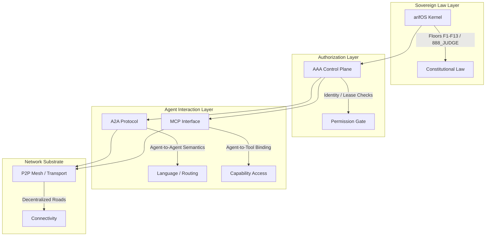
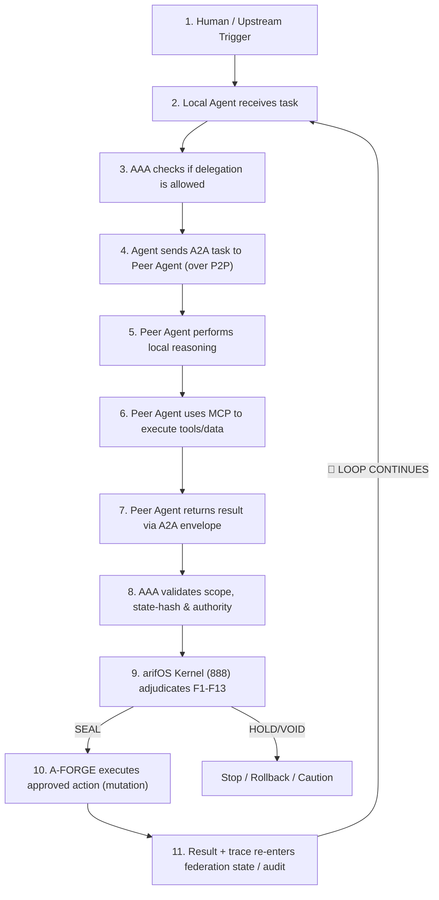

# UNIFIED AGENT ARCHITECTURE
## One Federation, Many Minds, Single Law

> **Canonical reference:** How the arifOS–A‑FORGE federation unifies 8 heterogeneous coding agents into one governed swarm.  
> **Author:** arifOS Federation  
> **Ratified:** 2026-06-05  
> **Supersedes:** Any agent-specific tool configuration that bypasses the federation kernel.  
> **DITEMPA BUKAN DIBERI**

---

## Core Thesis: Bridge, Don't Duplicate

Maximum capability with maximum safety requires **bridging** the gaps among agents, not introducing new restrictions or separate controllers. We build a common **capabilities & governance plane** that all agents interface with. By having one canonical capability library and one constitutional oversight system, each agent operates to its full potential without risk — because every action is checked and harmonized by the federation.

> **"7 talented musicians with no conductor" → One orchestra under one law.**

---

## Design Principles

| Principle | Meaning |
|-----------|---------|
| **No Dual Sovereignty** | No new orchestration kernels. Temporal + arifOS runtime + A-FORGE already exist. LangGraph, Phoenix, Zep, Mem0 are redundant. |
| **One Tool Vocabulary** | All agents discover and invoke tools through the same Capability Index. No agent is limited to its "native" tools. |
| **One Constitution** | F1–F13 apply uniformly, adjudicated by arifOS 888_JUDGE, regardless of which agent originated the action. |
| **One Audit Trail** | VAULT999 records every significant action with agent attribution. |
| **Contextual Discovery** | Agents see 5–15 relevant tools, not 97. Vector search + policy filtering prevents overload and misuse. |
| **Preserve Uniqueness** | Agents are not clones. Kimi debugs. Claude architects. Copilot completes. Each keeps its specialty. |

---

## Architecture Layers

The arifOS Federation operates as a structured, decentralized intelligence fabric divided into five distinct layers. This separation of concerns ensures that capability routing, protocol parsing, and security gating are decoupled.

### The Five-Layer Stack



| Layer | Analogy | Responsibility | Runtime Actuator |
|---|---|---|---|
| **P2P** | **Roads** | Network Topology & Connectivity | Libp2p / WebRTC Mesh / NATS JetStream (Transport) |
| **A2A** | **Language** | Inter-Agent Semantics & Negotiation | A2A Protocol / JSON-RPC Envelopes |
| **MCP** | **Hands** | Local Tool Execution & Resource Binding | stdio / SSE Model Context Protocol servers |
| **AAA** | **Permission**| Identity, Registry, and Authorization | AAA Cockpit / `deliberation.ts` / lease system |
| **arifOS**| **Law** | Constitutional Oversight & Verification | arifOS Kernel / 888_JUDGE / Floors F1-F13 |

---

## The 11-Step Closed Operational Loop

Every task delegated across the P2P fabric follows a strict, non-bypassable feedback loop to ensure security and alignment:




---

## Layer 1: Capability Fabric

### Global Capability Index

- **Location:** `registries/CAPABILITY_INDEX.json` + Qdrant `mcp_capabilities`
- **Size:** 97 tools across 9 MCP servers
- **Access:** All agents via `capability_search` / `capability_select`

Each tool is described by a **Capability Card** with:
- Semantic description + parameter schema
- Risk tier (low/medium/high/critical)
- Epistemic quality (CLAIM / PLAUSIBLE / HYPOTHESIS / ESTIMATE)
- Execution kind (read / write / execute / admin)
- Approval policy (auto / hold / human-required)
- 888 requirement flag

### Dynamic Discovery

Agents query contextually:
```
"I need to analyze Malaysian capital allocation" →
  wealth_governance_verdict (WEALTH)
  wealth_flow_liquidity (WEALTH)
  wealth_boundary_governance (WEALTH)
  arif_capability_select (arifOS)
```

Result: 5–15 relevant tools instead of 97-schema monolith.

### Agent-Specific Adapters

For non-MCP agents (Aider, Antigravity), adapters translate capability suggestions into native affordances:
- **Aider:** Python subprocess calls to `CapabilityStore.search()`
- **Antigravity:** Shell commands wrapped in governance preamble
- **Copilot (IDE):** Capability hints in Copilot instructions + terminal capture

All roads lead to the same tool invocation pipeline.

---

## Layer 2: Constitutional Governance

### Unified Floor Checkpoint

Every tool call from any agent passes through arifOS floor-checking:

| Floor | Check Example |
|-------|--------------|
| F1 AMANAH | Is this irreversible? Need explicit ack. |
| F2 TRUTH | Is there evidence? Cite or say UNKNOWN. |
| F7 STEWARDSHIP | No secret leakage, no system destruction. |
| F9 IDEMPOTENCE | Can this be safely retried? |
| F13 SOVEREIGN | Human outranks all agents. |

### Verdict Authority

- **SEAL** — Approved, logged to VAULT999
- **HOLD** — Paused, awaits human or 888_JUDGE
- **VOID** — Blocked, reason logged
- **SABAR** — Deferred, insufficient evidence

No agent can self-authorize. Even 888-APEX cannot SEAL without Trinity witness consensus.

### Risk Tiers & Capability Filtering

| Risk Tier | Agent Sees | Example Tools |
|-----------|-----------|---------------|
| **Low** | Read-only, high-evidence tools | `brave_web_search`, `wealth_health_check` |
| **Medium** | Write tools, reversible actions | `github.create_issue`, `arif_memory_recall` |
| **High** | Irreversible, state-changing | `arif_forge_execute`, `wealth_ledger_write` |
| **Critical** | Requires 888_SEAL | `arif_vault_seal`, production deploy |

The capability selector drops tools above the session's risk tier unless explicitly escalated.

---

## Layer 3: Cognitive Alignment

### Shared Substrate

All agents load common context at initialization:
- `AGENTS.md` — Constitutional doctrine
- `SOUL.md` — Voice, tone, formatting
- `USER.md` — Arif's preferences and identity
- `CONTEXT.md` — Live machine state

### Agent Cards

Each agent has a structured identity card in `agents/{id}/agent-card.json`:
- Unique strengths / role
- Tool proficiency and MCP server list
- Integration mode (native / ready / bridge)
- Risk tolerance and authority boundary

### Federated Memory Bus

**NATS JetStream:** `agent.memory.{agent_id}`

Every agent publishes structured telemetry:
```json
{
  "agent_id": "kimi",
  "task_hash": "sha256",
  "intent": "refactor sandbox",
  "tools_used": ["well_assess_reliability", "arif_forge_execute"],
  "outcome": "SEAL",
  "learnings": ["NodeSandbox.ts needs isolated-vm upgrade"]
}
```

**Ingestion pipeline:**
- L3 Qdrant — semantic retrieval
- L5 Graphiti — relationship graphs
- L6 VAULT999 — sealed canonical decisions

**Result:** Kimi learns from Claude's mistakes. Copilot knows what WEALTH tools succeeded yesterday.

---

## Layer 4: Agent Router (A-FORGE Phase 4)

The router assigns tasks to the best-suited agent:

| Intent Pattern | Route To | Why |
|----------------|----------|-----|
| Code gen / refactor / type-heavy | **Kimi** | SOTA debugging, algorithmic strength |
| Architecture / constitutional / deep reasoning | **Claude** | Safety-first, long context |
| Capital / zakat / EPF / market | **WEALTH** | Domain expertise |
| Geoscience / well logs / seismic | **GEOX** | Domain expertise |
| Quick web search / summaries | **Copilot / Meyhem** | Lowest latency |
| Build / deploy / systemd | **A-FORGE** | Execution bridge |
| Python / data pipeline | **Codex** | OpenAI function calling |
| Skill-driven automation | **OpenCode** | 40+ skills |
| Multi-file refactor with git | **Aider** | Git-integrated diff review |
| Google ecosystem / rapid gen | **Antigravity** | Gemini backend |

**Handoff:** Via NATS `agent.results.{task_id}`, not filesystem. Eliminates §10.5 Dynamic-State collisions.

---

## Non-MCP-Native Agents: Shim Architecture

### Aider
- **Mode:** Python fallback
- **Capability access:** `CapabilityStore.search()` via subprocess
- **Governance:** F1-F13 preamble in `.aider.conf.yml`
- **Bridge:** A-FORGE pattern detector on shell output

### Antigravity / Gemini
- **Mode:** Python subprocess + A-FORGE capture
- **Capability access:** Same Python fallback as Aider
- **Governance:** Capability hints in session preamble
- **Bridge:** Terminal Capture Guide → MCP translation

### Copilot (IDE-embedded)
- **Mode:** MCP-native in VS Code
- **Capability access:** `capability-index` MCP server
- **Governance:** Copilot instructions + A-FORGE output capture
- **Bridge:** Affordance hints in IDE context

---

## Canonical Artifacts

| Artifact | Location | Purpose |
|----------|----------|---------|
| Capability Index | `registries/CAPABILITY_INDEX.json` | 97-tool canonical registry |
| Capability Schema | `schemas/capability-card.schema.json` | Tool metadata schema |
| Task Envelope | `schemas/task-envelope.schema.json` | Unified task/result/telemetry object |
| Agent Registry | `AAA_AGENTS_REGISTRY.json` | All agents, tiers, pipelines |
| Agent Cards | `agents/{id}/agent-card.json` | Per-agent identity + capabilities |
| Access Guide | `AGENT_BRIDGE_ACCESS.md` | Per-agent connection instructions |
| Swarm Reference | `agents/CODING_AGENT_FEDERATION.md` | Quick-reference matrix |

---

## Tradeoffs & Boundaries

| Concern | Mitigation |
|---------|------------|
| **Complexity** | One-time investment. Adding a new tool updates all agents automatically via the index. |
| **Agent Friction** | Agents see filtered toolsets by default. Escalation is explicit, not automatic. |
| **Performance** | Vector search adds ~50ms latency. Negligible vs. LLM inference. |
| **Lock-in** | All schemas are open JSON. Qdrant is self-hosted. No SaaS dependency. |
| **Drift** | Nightly evals + VAULT999 audit trail catch constitutional drift before production. |

---

## Sovereignty Invariant

> **arifOS is the law layer.** Every AI tool call in this federation passes through it for validation, judgment, and audit. No agent — no matter how capable — can bypass F1–F13. The human sovereign (000-SALAM) outranks all.

This architecture does not limit agents. It **unshackles** them — by ensuring that every powerful action is safe, every discovery is shared, and every decision is traceable.

**Maximum capability. Maximum safety. One federation.**
