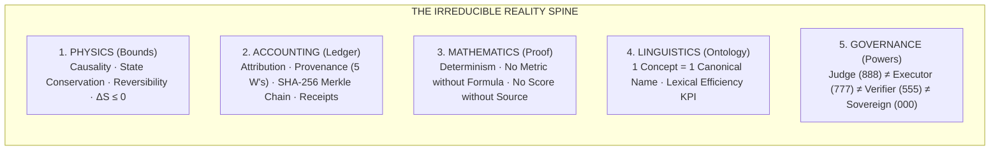

# arifOS Federation — Low-Entropy Reforge Canon (v1)

> **AUTHORITY:** ARIF (F13 Sovereign)  
> **RATIFIED:** 2026-08-15 (ARIFOS::LOW_ENTROPY_REFORGE::v1)  
> **CANONICAL SOT:** `/root/AAA/docs/LOW_ENTROPY_REFORGE.md`  
> **COMPANION SOT:** `/root/AAA/docs/ORGAN.md` (Human) · `/root/AAA/federation/organs.yaml` (Machine)

---

## 1. The Core Entropy Law

```
               Operational Truth (Verified Code + Physics + State)
Signal/Noise = ───────────────────────────────────────────────────
                  Structural Overhead + Ceremonial Vocabulary
```

The federation shifts all systems away from **narrative and appearance** into **verifiable physics, accounting, and deterministic code**.

---

## 2. The 7-Action Taxonomy (The Governance Operators)

Every component, file, endpoint, and doctrine must be classified under exactly one operator:

1. **IMMUTABLE**: Constitutional invariants whose violation damages physical reality (F1, F2, F11, F13).
2. **HARDEN**: Critical capabilities reinforced with strict compile-time types, runtime contracts, and error handling.
3. **COMPRESS**: Re-expressing $N$ redundant doctrine fragments into 1 canonical root with lightweight domain projections.
4. **MERGE**: Collapsing multiple names, registries, or manifests that describe the same underlying reality into a single SOT.
5. **HIDE**: Encapsulating internal implementation details (ports, socket paths, transport protocols) behind abstract capability URIs.
6. **PRUNE**: Safely removing obsolete tools, orphan staging directories, and dead code.
7. **COLLAPSE**: Dismantling governance and safety theatre that lacks programmatic runtime enforcement.

---

## 3. The Reforged Invariant Spine



### 3.1 Physics vs. Accounting Split
- **PHYSICS INVARIANTS**:
  - *Causality*: Outputs strictly succeed inputs; state transitions must trace uninterrupted causal lines.
  - *Conservation of State*: Mutations require explicit pre-state snapshots and rollback vectors.
  - *Thermodynamics*: $\Delta S \le 0$. Every turn must reduce entropy or halt.
- **ACCOUNTING INVARIANTS**:
  - *Attribution & Provenance*: Every mutation answers What, Who, When, Where, and How to Reverse.
  - *Receipt Discipline*: Autonomous Lane B receipts (`forge_vault`) and Lane A Constitutional Seals (`arif_seal`).

### 3.2 Constitutional Floors vs. Behavioral Interaction Policies
- **Hard Runtime Floors (Fail-Closed Execution Blockers)**:
  - `F1 (AMANAH)`: Reversibility & blast-radius gate.
  - `F2 (TRUTH)`: Empirical evidence requirement ($P(\text{truth}) \ge 0.99$).
  - `F3 (TRI-WITNESS)`: Multi-perspective Nash verification.
  - `F4 (CLARITY)`: Entropy non-increase ($\Delta S \le 0$).
  - `F7 (HUMILITY)`: Strict confidence ceilings ($\Omega \le 0.97$).
  - `F11 (AUDITABILITY)`: Full provenance and trace logging.
  - `F12 (RESILIENCE)`: Prompt-injection and boundary defense.
  - `F13 (SOVEREIGN)`: Sovereign human veto and final consent.
- **Behavioral Interaction Constraints (Policy Layer)**:
  - `F5 (PEACE²)`: Non-destructive interaction constraints.
  - `F6 (EMPATHY ⇄ MARUAH)`: Dual-registry lossless dignity bridge.

---

## 4. Capability URI Encapsulation (Port-Hiding Rule)

Internal network topology and port allocations are encapsulated behind protocol URIs:

| Raw Socket (Implementation) | Capability URI (Agent Semantic Reality) |
|---|---|
| `127.0.0.1:8088` | `capability://arifos` (Kernel Governance & SCT) |
| `127.0.0.1:7071` / `:7072` | `capability://aforge` (Execution & Mutation Actuator) |
| `127.0.0.1:8081` | `capability://geox` (Earth Evidence & Subsurface Physics) |
| `100.64.0.2:18082` | `capability://wealth` (Capital Allocation & Macro Signals) |
| `100.64.0.2:18083` | `capability://well` (Homeostasis, Substrate & Vitality) |
| `127.0.0.1:7073` | `capability://arifflow` (Job Queue & Vector Scheduler) |

---

## 5. Anti-Echo Grounding Law

> **LLMs agreeing among themselves is synthetic echo, not truth.**

Multi-agent deliberation is valid **only** when grounded in an independent empirical witness:
$$\text{Truth} = \text{Hypothesis} \times \text{Empirical Reality Probe (Code / Database / Sensor / Physics)}$$

Any multi-agent loop lacking an external reality anchor will be tagged `INADMISSIBLE-SYNTHETIC-ECHO` and blocked from sealing.

---

## 6. Lexical Density KPI

All documentation, prompt systems, and skill descriptions must maximize the lexical ratio:
$$\text{Lexical Density KPI} = \frac{\text{Operational Meaning Gained}}{\text{Distinct Terms Learned}}$$

Synonyms are forbidden. One concept = One canonical term across all 6 organs.

---

## 7. The OBS-1 Reality Invariant & Truth Cockpit Standard

> **OBS-1 INVARIANT:**
> Nothing may be rendered as status unless it has:
> **Value · Timestamp · Provenance Source · Measured Freshness**
> If any of these four elements is missing, **DO NOT RENDER** — do not pollute the interface with "unavailable / missing / unknown" placeholders.

### The 20% Truth Cockpit (Canonical Standard)
1. **Runtime Identity**: Repo HEAD · Deployed Commit · Clean/Dirty Drift.
2. **Organ Liveness**: Live TCP + Latency for arifOS, A-FORGE, GEOX, WEALTH, WELL, arifFlow.
3. **Truth Witness (VAULT999)**: Head Sequence · Merkle Root · Unbroken Hash Chain.
4. **Thermodynamic Pulse**: AED FQ · Active Mutation Gate State (HOLD/ALLOW).
5. **Telemetry Freshness**: Observed At · Age in Seconds · Provenance Source.

