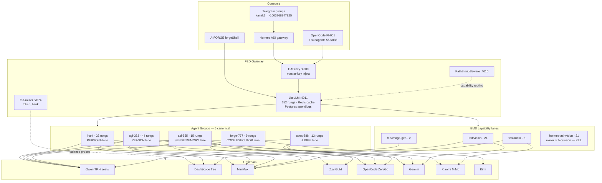

# FED GENESIS MAP — Internal Literature Review & Zen Doctrine
> Forged 2026-08-30 by 333-AGI (OpenCode) under F13 directive: *"deep research how litellm can be zen, max 5, harden the 4, explore the 5th, map all FED ever forged, knowledge graph, statics dynamics, make X jadi bagan."*
> Sources: git history (45 commits), litellm-config.yaml, LiteLLM_SpendLogs (14d live traffic), federation-models.json, AGENT_MODEL_MAP.json (frozen), fed_signatures.yaml (tombstoned), live probes.

---

## 1. Executive Verdict (DER)

**LiteLLM is already zen at its core — one proxy, one master key, one Postgres, Redis cache, order-based cascade. The chaos is NOT LiteLLM. The chaos is 61 models × 9 groups × 152 rungs fanned onto it.** Real traffic uses ~7 models through 4 lanes. The zen move is subtraction, not re-engineering: collapse to **5 agent groups + 3 slim EMD lanes ≈ 30 rungs**, purge the ~120 dead-weight rungs that serve <100 calls/14d.

**Max-5 answer**: the 5th slot is already forged and carrying the 2nd-heaviest traffic — **forge-777**. Do not invent a 6th. Do not kill forge-777.

---

## 2. Evolution Timeline — Every Era of FED (OBS, git-mined)

| Era | Date | Commits | What was forged |
|---|---|---|---|
| **Genesis** | 2026-07-02 | 3cf54552 | First litellm-config in A-FORGE (agent card v2.2 era) |
| **Entropy war** | 07-02→08-02 | f21064c7, 374e19e5 | No-DB + no-telemetry doctrine; chaos reduction sweeps |
| **FLAME v2** | 08-02→08-04 | ab9dfbf1, 2d605544, 37e26222, 6c4c8ddd | FED FLAME FRAME v2, codex routing, SQLite→Postgres for master-key auth, hermes-asi multimodal |
| **Cascade zen** | 08-05→08-09 | 8a671002, 4261eaa6, 8d465737, 5c2cec75, ac270fa8, 5b93df5c, 99871855, a68b37a4 | Priority routing + cost labels, real context windows on 28 aliases, Gemini seat policy, Individual-key failovers, 3 EMD aliases (fed/vision, fed/audio, fed/image-gen) |
| **Actor envelope** | 08-10→08-14 | 0a5a9d1a, dc112745, e1711c0e, a079657f, a9bc8c69, 97a70cf1 | MiMo re-enabled, V3 identity sync, i-arif re-indent, Gemini native+BLOCK_NONE, i-arif reordered off Qwen moderation, dead-provider prune (~440 lines), zai-pro→glm-5.2 alias |
| **Seat-failover bloom** | 08-15→08-26 | (post-bak commits) | Qwen 4-seat fan-out, OpenCode Go/Zen rungs, DashScope free-quota BURN FIRST rungs, qwen3-coder family for forge-777, hermes-asi-vision mirror (22 dupes), MiniMax Token Plan Max |
| **SCAR era** | 08-30 | config comments | mimo-v2.5 + mimo-v2.5-pro deleted from i-arif (Xiaomi content_filter kills family chat in kanak2 group) — F13: *mimo must NEVER serve i-arif persona traffic* |
| **CRASH era** | 08-30 | this session | litellm-federation restart loop (prisma client wiped + npm/python prisma version war), :4000 503, minimax-relay front-door hijack, stale DB schema 42P10 — ALL FIXED (joint 333-AGI + APEX session), mimo purged from persona-reachable cascade, 152 entries live |

**Registry archaeology**: AGENT_MODEL_MAP.json FROZEN 2026-08-15 (superseded by federation-models.json) · fed_signatures.yaml TOMBSTONED 2026-08-17 · 12 config .baks preserved in A-FORGE root.

---

## 3. Complete Model Inventory — Everything Ever Wired (OBS)

**79 distinct models ever forged into FED. 61 live today. 18 retired.**

### Live (61) — by family
- **Qwen text (13)**: qwen3.8-max, 3.7-max, 3.7-plus, 3.6-plus, 3.6-flash, 3.8-27b, 3.8-2.4t-a95b, qwen-plus-latest, + dated snapshots (05-17/05-20/05-26/06-08)
- **Qwen VL/omni (13)**: qwen-vl-max, vl-ocr, 3-vl-plus/flash/235b-a22b-inst/think, 3-vl-32b±think, 3-vl-30b-a3b±think, 3-vl-8b±think, 3-omni-flash
- **Qwen coder (5)**: 3-coder-plus/flash/next/30b-a3b/480b-a35b
- **DeepSeek (6)**: v4-pro, v4-pro-0813, v4-flash, v4-flash-0731, v3.2
- **GLM (4)**: glm-5, 5.1, 5.2, 5.3
- **Kimi (4)**: k3, k2.6, k2.7-code, k2.5
- **MiniMax (2)**: M3, M2.5
- **Xiaomi MiMo (5)**: mimo-v2.5-pro (agi-333/asi-555 text only), mimo-v2.5-asr/-tts/-tts-voiceclone (speech only) — chat/omni rungs SCARRED OUT of persona lanes
- **Claude (2)**: sonnet-5, opus-5 (opencode-zen)
- **Gemini (2)**: 2.5-pro, 3.6-flash
- **Speech/image**: speech-2.8-hd/turbo, wan2.7-image/-pro
- **Qwen next-gen (1)**: qwen3-next-80b-a3b

### Retired (18) — gravestones
glm-4.6v, glm-4.7, glm-5-turbo, gemini-2.5-flash, gemini-3-flash-preview, gemini-3.1-pro(-preview), gemini-3.5-flash-lite, gemini-flash-lite-latest, MiniMax-M2.5-highspeed, MiniMax-M2.7, minimax-m3 (lowercase ghost), mimo-v2.5 (chat), qwen3.7-flash, qwen2.5-coder:3b (ollama), llama-3.3-70b-versatile, SEA-LION v4-32B, free-aggregator, glm-5.3[1m] (ctx alias)

### Upstream provider classes (11)
Qwen Token Plan (4 seats: team-owner/arifos/ariffazil/individual) · DashScope free-quota (BURN FIRST, expires 09-29→11-18) · OpenCode Zen ($19.96) · OpenCode Go ($10) · Z.ai Coding Plan · MiniMax Token Plan Max ($50/mo) · Xiaomi MiMo Token Plan · Gemini free tier · MuleRouter (disabled, negative balance) · Kimi direct · DeepSeek direct (insolvent-era, mostly dead)

---

## 4. Knowledge Graph — STATICS (the bagan)

**Fallback graph (post-hardening 08-30)**: `i-arif → [apex-888]` (family-safe ONLY) · `forge-777 → [i-arif, agi-333, apex-888]` · `agi-333 → [i-arif, forge-777, apex-888]` · `asi-555 → [i-arif, agi-333, apex-888]` · `apex-888 → [agi-333]`. **Xiaomi mimo unreachable from any persona lane** — only agi-333/asi-555 text + speech endpoints.

---

## 5. DYNAMICS — 14-Day Traffic Truth (OBS, LiteLLM_SpendLogs)

| Lane | Calls | Tokens | Served by (actual) |
|---|---|---|---|
| i-arif | **15,198** | **1.94 GTok** | mimo-v2.5* 5,489 · glm-5.3 3,747 · M3 2,701 · mimo-pro* 1,096 · qwen3.8-max 534 · tail ~2,000 (*pre-scar; now banned) |
| forge-777 | **7,535** | **1.46 GTok** | M3 5,278 (70%) · glm-5.3 1,057 · kimi-k3 723 |
| agi-333 | **5,590** | 478 MTok | M3 4,574 (82%) · mimo-pro 577 · dsv4-pro 107 · 19-model long tail |
| apex-888 | 11 | ~0 | via FED idle — 888-APEX runs direct (minimax-direct in OpenCode) |
| asi-555 | 10 | 0.7 MTok | via FED idle — 555 runs direct (qwen3.6-flash) |
| fed/vision | 3 | ~0 | 21 rungs for 3 calls |
| fed/audio · image-gen | 1 · 0 | ~0 | speech runs via direct mimo endpoints |
| (unattributed) | 272,824 | 49 MTok | ⚠ F4 debt: empty model_group flood thru 08-26, then stopped — attribution hole logged |

**Dynamics verdict**: 4 lanes carry ~100% of real traffic. apex-888/asi-555 via FED are nearly idle because OpenCode subagents bind direct providers. Real work concentrates on **7 models**: MiniMax-M3 (46%), glm-5.3, kimi-k3, mimo-v2.5-pro, deepseek-v4-pro, qwen3.8-max/3.7-max family. The other ~50 live-configured models are cold spare weight.

---

## 6. The Max-5 Doctrine — Hardening Plan

### The 4 canonical (harden)
| Agent | Group | Hardening (from traffic + scars) |
|---|---|---|
| **i-ARIF** (persona) | i-arif | ✅ DONE today: mimo banned, fallback→apex-888 only. Next: collapse 22→4 rungs (qwen3.8-max P1 · glm-5.3 P2 · deepseek-v4-flash P3 · M3 P4) |
| **333-AGI** (reason) | agi-333 | Collapse 44→5 rungs (M3 · mimo-pro · dsv4-pro · glm-5.3 · qwen3.8-max). Kill 6 qwen-seat mirrors + 15 DashScope snapshots that serve <100 calls |
| **555-ASI** (sense/memory) | asi-555 | Collapse 15→3 (M3 · qwen3.7-plus · gemini-3.6-flash all vision-capable). Fold hermes-asi-vision INTO asi-555 or fed/vision — kill the 21-rung mirror |
| **888-APEX** (judge) | apex-888 | Collapse 13→4 (gemini-2.5-pro · claude-sonnet-5 · claude-opus-5 · deepseek-v4-pro). Gödel E3 already satisfied (3 provider families) |

### The 5th slot — VERDICT: forge-777, already forged
Evidence: 7,535 calls/14d = 2nd heaviest lane, distinct workload (MCP coding executor, streaming tool-use verified 08-26), separate from agi-333's reasoning. Killing it = merging executor into reasoner = mesa violation (doer≠judge separation). **Keep 5 groups: i-arif · agi-333 · asi-555 · apex-888 · forge-777.**

### EMD lanes (not agents — capability aliases, slim them)
fed/vision 21→4 (qwen3-vl-plus · qwen-vl-max · gemini-3.6-flash · qwen3-vl-flash) · fed/audio 5→3 (speech-2.8-hd · mimo-asr · mimo-tts-voiceclone) · fed/image-gen 2→2 (keep) · **hermes-asi-vision: DELETE** (Hermes → fed/vision alias).

### Zen target: **152 → ~31 rungs** (ΔS ≈ −80% config entropy)

---

## 7. Zen Rules Going Forward (SPEC)

1. **One group = one job.** Never wire a persona lane to a provider with family-content filters (Xiaomi scar). Never wire a single-provider relay to the multi-persona front door (minimax-relay scar).
2. **A rung must earn its seat**: >100 calls/14d or a named constitutional role (Gödel E3 judge, free-burner, survival knife). Everything else = cold storage in git history, not live config.
3. **Snapshot models (qwen3.7-max-2026-05-20 etc.) are consumables**, not architecture. Max 3 BURN-FIRST rungs at a time, parked on ONE group.
4. **Fallbacks are policy, not carpet**: persona lanes fall back to family-safe judges only. Code lanes may fall back anywhere except persona filters.
5. **One SOT**: litellm-config.yaml = routing truth; federation-models.json = identity truth. Kill remaining drift: AGENT_MODEL_MAP (frozen, ok), fed_signatures (tombstoned, pointer in AGENTS.md stale — fix pointer), hermes-asi-vision (kill group).
6. **Boot discipline**: litellm-federation boots in ~3.5 min (152-rung parse + prisma). 30-rung zen config ≈ sub-60s boot = fewer 503 windows. Prisma client now pinned (0.15.0) + generated — a wiped client = crash loop (today's scar: *check dependency pins before declaring infra dead*).

## 8. Open debts (logged, not today)
- F4: 272k unattributed calls (attribution hole, pre-08-26) — schema fresh now, watch for recurrence
- fed/audio MiniMax speech rungs reference a MiMo env var name variant (ghost drift) — verify before next touch
- Qwen Team seats exhausted (0/150k, reset 09-01) · MiniMax weekly 2056 resets rolling · Individual seat ~2d runway on current window (renews 09-01)
- organ-health-sentinel cron needs model pin · Hermes 0.20.6 upgrade = separate session · corrupt-state-20260830/ archive (550MB)

---
*ΔS negative. DITEMPA BUKAN DIBERI ⚒️ — 333-AGI, SEAL-pending*
