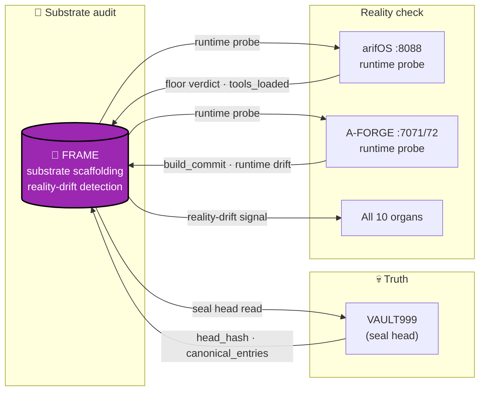

<!-- SOT-MANIFEST
federation_release: v2026.08.25
last_verified: 2026-08-25T12:14:00Z
live_commit: ee6771ad6326af3802a0e20da3dd19db7e04441c (fix(license): add AGPL-3.0 LICENSE — matches badge + doctrine)
organ: FRAME
role: substrate-organ (frame-organ.service — capability substrate)
authority: OBSERVE_ONLY — provides substrate primitives, never adjudicates
license: AGPL-3.0
truth_rule: live systemctl status frame-organ.service + /health endpoint beat any static count in prose
-->

# 🧱 FRAME — Frame Organ Substrate

[](https://arifos.arif-fazil.com)
[](https://arif-fazil.com)
[](./LICENSE)

> **FRAME is the substrate. It scaffolds. It never decides.**
> **DITEMPA BUKAN DIBERI — Forged, Not Given.**

**FRAME** is the substrate organ of the arifOS Federation. It provides capability primitives — scaffolding, lifecycle, and observability hooks — for the higher-order organs (arifOS, A-FORGE, AAA, GEOX, WEALTH, WELL). FRAME is OBSERVE_ONLY: it scaffolds and exposes primitives; it never adjudicates or executes irreversible actions.

---

## What FRAME Is

| Capability | Examples |
|------------|----------|
| **Substrate lifecycle** | `frame-organ.service` — Python systemd unit, venv at `/opt/frame/venv`, app at `/opt/frame/app` |
| **Build/dev tooling** | `Makefile` targets — `install`, `test`, `deploy`, `clean`, `health` |
| **Federation primitive** | Common Python packaging (`pyproject.toml` + `uv.lock`), exposed for organ replication |
| **OBSERVE_ONLY surface** | Health probe via systemd; no public MCP wire (FRAME is internal scaffolding) |

## What FRAME Is NOT

- ❌ Not an MCP server. FRAME does not expose public tools.
- ❌ Not an execution shell. A-FORGE owns execution.
- ❌ Not a judge. arifOS owns adjudication.

---

## 🏛️ Federation Context

```
arifOS   = otak  ⚖️  (judge   — the brain,   :8088)
A-FORGE  = tangan 👐  (forge  — the hands,  :7071)
AAA      = mind  🏛️  (cockpit— the mind,   :3001)
arifFLOW = saraf 🧠  (flow   — the nerves,  :7073)
GEOX     = bumi  🌍  (earth  — the witness, :8081)
WEALTH   = emas  💰  (capital— the interpreter, :18082)
WELL     = hati  🫀  (vital  — the reflector, :18083)
FRAME    = batu  🧱  (stone  — the substrate, :frame-organ.service)
VAULT999 = tulang 💀  (bones  — the structure)
```

Source-of-truth: [`/root/AGENTS.md`](/root/AGENTS.md) and [`AAA/docs/ORGAN.md`](https://github.com/ariffazil/AAA).

---

## 🔧 Operating

```bash
# Install (local dev)
make install

# Test
make test

# Deploy to live substrate (VPS af-forge)
make deploy

# Health
make health
```

The systemd unit `frame-organ.service` exposes lifecycle primitives; the `Makefile` is the canonical operator surface.

---

## 🛡️ CI Governance (F13 verdict 2026-08-10)

FRAME follows the federation's CI governance pattern, adapted for Python (`pyproject.toml + uv.lock`):

- `.github/dependabot.yml` — `uv` ecosystem; cooldown 3d; open-PRs 5; constitutional packages un-grouped (no `ignore:`)
- `.github/workflows/dependabot-ci.yml` — unprivileged gate; runs ONLY on Dependabot PRs; SHA-bound probes
- `.github/workflows/ci-uv-lock-invariant.yml` — universal `uv lock --check && uv sync --frozen`
- `.github/workflows/auto-merge-dependabot.yml` — constitutional package denylist; F13 review the only merge path
- Privileged workflows gated with `if: github.actor != 'dependabot[bot]' && != 'app/dependabot'`

Reference: PR #1 (FRAME pattern replication).

---

## 🧬 Source-of-Truth

- **Canonical SOT:** [`/root/AGENTS.md`](/root/AGENTS.md) — federation-wide doctrine
- **Organ SOT:** [`AAA/docs/ORGAN.md`](https://github.com/ariffazil/AAA) — topology + ports
- **Live health:** `systemctl status frame-organ.service` + `journalctl -u frame-organ.service`
- **Constitutional floors (F1–F13):** enforced by **arifOS** — FRAME consumes the verdict, does not adjudicate

---

## 📜 Sovereignty & License

- **License:** GNU Affero General Public License v3.0 (**AGPL-3.0**)
- **Sovereign:** **Muhammad Arif bin Fazil** (F13 SOVEREIGN). Human veto is absolute.

> *DITEMPA BUKAN DIBERI — Forged, Not Given.*  
> *Truth must cool before it rules. 999 SEAL ALIVE.*

---

## 🗺️ Where FRAME Sits in the Federation



**FRAME internal loop:**

```
seal-chain head read (from VAULT999 :999/verify)
        │
        ▼
cross-verify (independent endpoint — AAA :3001 seal-chain)
        │
        ▼
runtime probe (each organ /health)
        │
        ▼
drift matrix (gap_count · staleness · floor_count · tools_count)
        │
        ▼
emit drift signal → AAA + arifOS + arifFlow + FED
```

**Hard rules (OBSERVE ceiling):**
- FRAME never adjudicates. Drift signal is observation, not verdict.
- FRAME never executes. Pure probe + report.
- FRAME never rewrites VAULT999. It only reads head_hash.

---

## 🏅 Federation Certification

[](https://arifos.arif-fazil.com/health)
[] (private repo — see arifOS FEDERATION.md)

---
