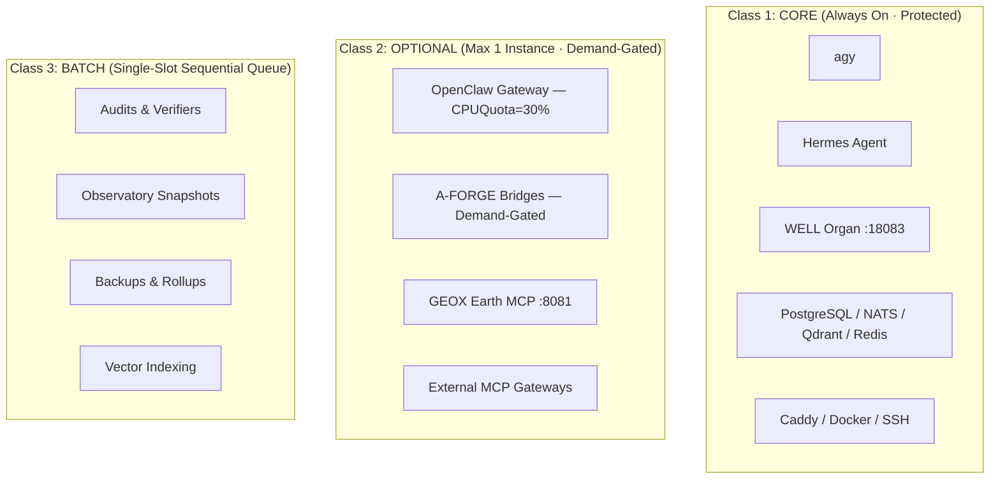

# arifOS: Workload Governance & Chaos-Reduction Architecture

> **Doctrine:** DITEMPA BUKAN DIBERI  
> **Authority:** F13 Sovereign (Arif Fazil) Directive — 2026-08-27  
> **Core Law:** The VPS does not have a CPU deficit; it has an uncoordinated concurrency deficit. Concurrency is a strictly budgeted resource.

---

## 1. The Core Invariant: Three Service Classes

Every daemon, worker, bridge, and MCP process in the arifOS Federation is strictly categorized into one of three classes:

### Class Definitions & Rules

1. **CORE (Always On · Protected):**
   - Must never be killed, auto-paused, or choked by batch work.
   - Preserves system responsiveness and operator access.
   - Includes: `agy`, `hermes`, `well`, `postgres`, `nats-server`, `caddy`, `qdrant`, `redis`.

2. **OPTIONAL (Single-Instance · Demand-Gated · Quota-Bound):**
   - Strictly single-instance (no duplicates permitted).
   - Must have hardware quotas enforced in supervisor configs (`CPUQuota <= 30%`, `MemoryMax`).
   - Includes: `openclaw`, `sheets_bridge`, `social-mcp`, `geox`.

3. **BATCH (Single-Slot Sequential Queue):**
   - **Hard Invariant:** Exactly **ONE** heavy job runs at any given time (`Batch Slot = 1`).
   - Never overlap full-disk scans, vector indexings, or heavy repository verifiers.
   - Must carry execution timeouts and exponential backoff.

---

## 2. The Circuit Breakers (Anti-Thrashing Laws)

### Law 1: Restart-Loop Breaker
- **Limit:** Maximum **3 restarts within 15 minutes**.
- **Action:** If a process crashes 3 times, the supervisor halts auto-restart, marks the unit as `QUARANTINED`, and emits a single-line alert to the daily briefing.
- **Forbidden:** Never allow a watchdog or systemd service to restart hundreds or thousands of times (`RestartSec` must scale with backoff).

### Law 2: CPU Steal & Load Circuit Breaker
- If 5-minute Load Average exceeds `8.0` on an 8-vCPU system:
  1. Freeze all pending Class 3 (Batch) queue jobs.
  2. Throttle or pause non-essential Class 2 (Optional) integrations.
  3. Never touch Class 1 (Core).

### Law 3: Zero Full-Disk Walk Invariant
- No scheduled script may execute unbounded `os.walk("/")` or recursive `find /`.
- Repository scanners must restrict scope exclusively to explicit repo paths defined in `repo-atlas.yaml`.

---

## 3. Human Experience: The Minimal Daily Briefing

Arif is a human sovereign, not a terminal operator. The machine communicates via a single quiet daily status:

> **arifOS Status:** 🟢 All Core Healthy (8/8) · Optional: 1/4 active · Batch: Idle · Load: 2.5 (Cool) · Zero Restart Loops · No Action Required.
