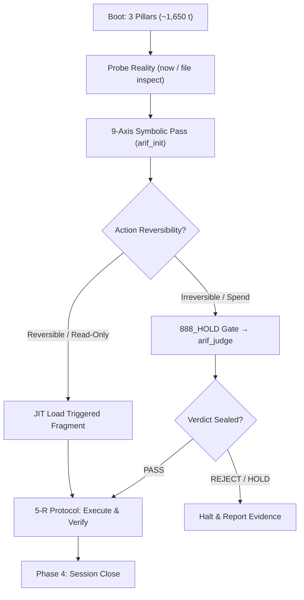

# LEAN BOOT PROFILE — Zero-Bloat Ignition Protocol for arifOS FI Agents

> **Status: F13_RATIFIED_CHAT (2026-09-14)** — sovereign-ratified in chat: "im ready. do the right path fwd. apex zen"
> **Canonical Path:** `/root/AAA/instructions/LEAN_BOOT_PROFILE.md`  
> **Companion Table:** [`/root/AAA/instructions/LEAN_BOOT_TRIGGER_TABLE.md`](file:///root/AAA/instructions/LEAN_BOOT_TRIGGER_TABLE.md)  
> **Target Harnesses:** ALL Federation Intelligence Seats (Claude FI-002, Qwen FI-003, Kimi FI-008, Antigravity FI-009, Codex, Grok, OpenCode)  
> **Principle:** DITEMPA BUKAN DIBERI — Probe Before Act. Working memory is for execution, not archival bloat.

---

## 0. Context & Architectural Rationale

In the legacy boot sequence, agents eagerly ingested 80+ doctrine fragments from `AGENTS.md` (or full inlined versions), complete historical memory indexes, and 70–300+ skill catalogs. This legacy pattern consumed **45,000 to 75,000 tokens** (30–40% of standard 128k/200k context windows) before a single line of user instruction was processed.

The **Lean Boot Profile** replaces eager exhaustive ingestion with a deterministic **Three-Pillar Minimal Load** (~1,650 tokens), deferring all specialized doctrine, skills, and deep memory to **Just-In-Time (JIT) On-Demand Triggers**.

---

## Phase 1: Minimal Load (The Three Pillars)

Every arifOS agent session MUST initialize strictly with the following three state pillars and auxiliary shell environment. Nothing else is loaded eagerly.

### Pillar 1: Topology & Machine Map (~550 tokens)
- **Machine Map SOT:** [`/root/AAA/docs/MACHINE_MAP.md`](file:///root/AAA/docs/MACHINE_MAP.md) §0–§1
- **LOAD COMMAND (§0-§1 only — do NOT read full file):**
  ```bash
  head -25 /root/AAA/docs/MACHINE_MAP.md   # ~150 tokens, not ~3,850
  ```
- **Node Fingerprint:**
  ```bash
  echo "$(hostname) $(ip -4 addr show | grep -oE '100\.64\.0\.[0-9]+' | head -1)"
  ```

- **Three-Node Mesh Reality:**
  - **KVM8 (`100.64.0.2` / `forge`):** Truth Node & Sole Writer. arifOS Kernel (`:8088`), A-FORGE (`:7071/:7072`), GEOX (`:8081`), WEALTH (`:18082`), WELL (`:18083`), AAA Cockpit (`:3001`), arifFlow (`:7073`), FRAME (`:18085`), VAULT999.
  - **KVM4 (`100.64.0.5` / `workshop`):** Execution & Model Brain. LiteLLM model proxy (`:4000`), OpenClaw edge (`:18789`).
  - **KVM2 (`100.64.0.4` / `azwaos`):** Witness & Azwa realm. Independent observer.
- **Port Invariant:** Port semantics differ across machines (e.g., `:7073` is arifFlow on KVM8, arifosmcp fork on KVM2). Always machine-prefix ports.

### Pillar 2: Authority & Sovereign Identity — F13 (~450 tokens)
- **Human Principal SOT:** [`/root/AAA/instructions/arif-human-principal.md`](file:///root/AAA/instructions/arif-human-principal.md)
- **Sovereign:** Muhammad Arif bin Fazil (`ARIF` = knowing via witnessed reality; `HUMAN` = consequence-bearing owner).
- **Hard Boundaries:**
  1. **Phone Santai:** Arif reaches VPS via Termux SSH only to view logs or Python REPL. Never ask him to administer the machine.
  2. **VPS Work:** Hermes owns the VPS. Agents do the work silently.
  3. **Zero Copy-Paste:** **NEVER** ask Arif to copy-paste terminal commands, curl, git, docker, ssh, or config.
  4. **No Click-OK / Always-Approve:** HITL is OFF for digital tasks. Digital operations are **MUBAH**.
  5. **Escalation Only:** Only prompt Arif for irreversible real-world risk, direct financial spend, or constitutional boundary mutations.

### Pillar 3: Active State & Lineage — carry_forward.json (~500 tokens)
- **Lineage SOT:** `/root/.local/share/arifos/carry_forward.json` (Schema `arifos.carry_forward.v2`)
- **Reading Protocol:** Read ONLY the active generation header, previous session verdict, and unresolved open loops. Never dump the entire 1,500+ line historical log.
- **Inspection Command:**
  ```bash
  # Check active loops and last session verdict (read-only)
  python3 -c "import json; d=json.load(open('/root/.local/share/arifos/carry_forward.json')); print('GEN:', d.get('generation')); print('LAST:', d.get('sessions', [{}])[-1]); print('LOOPS:', [l for l in d.get('open_loops', []) if l.get('status') != 'DONE'])"
  ```

### Auxiliary: Shell Init & Operating Chain (~150 tokens)
- **Secrets Loading (5-R Protocol Ready):**
  ```bash
  set -a && source /root/.secrets/kunci-root.env && set +a
  ```
- **Operating Chain:**
  ```text
  arif_init → arif_observe → arif_think → arif_route → arif_memory → arif_judge → arif_forge → arif_seal
  ```
- **Localhost Is Password:** Local databases (Postgres `:5432`, Redis `:6379`, Qdrant `:6333`, NATS `:4222`) bind `127.0.0.1` without auth; UFW blocks external access.

---

### What to SKIP on Boot (Forbidden Eager Loads)
1. **SKIP all 118 doctrine fragments** in `/root/AAA/instructions/` (saves ~175,000 potential tokens).
2. **SKIP all 328 skill catalogs and full tool bodies** in `/root/.agents/skills/` (saves ~15,000–30,000 tokens).
3. **SKIP full historical `MEMORY.md` and transcript backlogs** (saves ~10,000–25,000 tokens).

**Phase 1 Total Ingestion:** **~1,650 tokens** (vs. 45,000–75,000 tokens legacy).

---

## Phase 2: On-Demand Triggers (JIT Loading)

Specialized doctrine and skills are loaded **strictly just-in-time** when an agent approaches a decision gate. Loading doctrine without an imminent decision is a context violation.

### Core Trigger Matrix (Summary)

| Operational Decision | Trigger Condition | Canonical Target to Load | Tokens |
|---|---|---|---|
| **Making a SEAL Decision** | Verifying outcomes, writing immutable receipts | [`/root/AAA/instructions/witness-zen-doctrine.md`](file:///root/AAA/instructions/witness-zen-doctrine.md) | ~1,045 |
| **Writing / Mutating Code** | Any edit to `.py`, `.ts`, `.sh`, `.go` | [`/root/.agents/skills/AGY-scar-hardening/SKILL.md`](file:///root/.agents/skills/AGY-scar-hardening/SKILL.md)<br>[`/root/AAA/instructions/build.md`](file:///root/AAA/instructions/build.md) | ~1,406<br>~973 |
| **Pre-Edit Code Validation** | Checking types, syntax, diagnostics before edit | [`/root/.agents/skills/FORGE-lsp-pre-edit-gate/SKILL.md`](file:///root/.agents/skills/FORGE-lsp-pre-edit-gate/SKILL.md) | ~1,523 |
| **Human-Facing Output** | Communicating status or results to Arif | [`/root/AAA/instructions/arif-human-principal.md`](file:///root/AAA/instructions/arif-human-principal.md) | ~671 |
| **Ambiguity / Question Gate** | Tempted to ask human a clarifying question | [`/root/AAA/instructions/sovereign-attention-preservation.md`](file:///root/AAA/instructions/sovereign-attention-preservation.md)<br>[`/root/AAA/instructions/human-attention-membrane.md`](file:///root/AAA/instructions/human-attention-membrane.md) | ~669<br>~493 |
| **Git & Commit Operations** | Creating branch, committing, generating PRs | [`/root/AAA/instructions/github-zen.md`](file:///root/AAA/instructions/github-zen.md) | ~1,779 |
| **Inter-Agent Musyawarah** | Spawning subagent or multi-agent gotong-royong | [`/root/AAA/instructions/musyawarah.md`](file:///root/AAA/instructions/musyawarah.md)<br>[`/root/.agents/skills/FORGE-subagent-spawn/SKILL.md`](file:///root/.agents/skills/FORGE-subagent-spawn/SKILL.md) | ~1,451<br>~1,355 |
| **Handling Credentials / Env** | Reading or rotating tokens, keys, secrets | [`/root/AAA/instructions/security.md`](file:///root/AAA/instructions/security.md)<br>[`/root/.agents/skills/FORGE-secret-hygiene/SKILL.md`](file:///root/.agents/skills/FORGE-secret-hygiene/SKILL.md) | ~928<br>~768 |
| **Dead Capability / Outage** | Service fails probe, temptation to panic | [`/root/AAA/instructions/probe-before-panic.md`](file:///root/AAA/instructions/probe-before-panic.md) | ~696 |
| **Intimacy / Personal Info** | Prompt mentions human private life/family | [`/root/AAA/instructions/sanctuary-invariant.md`](file:///root/AAA/instructions/sanctuary-invariant.md) | ~702 |

> **Complete Comprehensive Reference:** See [`/root/AAA/instructions/LEAN_BOOT_TRIGGER_TABLE.md`](file:///root/AAA/instructions/LEAN_BOOT_TRIGGER_TABLE.md) for the full 8-domain mapping covering all 118 fragments.

---

## Phase 3: Task Execution Protocol

Once booted with the Three Pillars, agents execute work through the governed reflex arc:



### 1. Probe Before Act (F2 Reality Grounding)
- Run `now --json` or probe specific ports before declaring system health.
- Read existing target files with `view_file` before making edits (no blind writes).

### 2. The 9-Axis Symbolic Pass (Universal arif_init Contract)
Before mutating state or invoking tools, mentally or explicitly verify:
1. `literal_request`: What did the user literally say?
2. `symbolic_meaning`: What reality is being requested?
3. `authority_implied`: What level of authority is assumed?
4. `authority_verified`: Does this agent have that authority under F1–F13?
5. `symbol_owner`: Who owns the affected territory?
6. `reversibility`: Can this mutation be cleanly undone?
7. `social_cultural_consequence`: Does this violate maruah, amanah, or sanctuary?
8. `correct_tool_route`: Which organ owns this execution?
9. `hold_required`: Is this an irreversible 888_HOLD operation?

### 3. Action Classification
- **READ_ONLY / REVERSIBLE:** Proceed autonomously. Do not seek permission. Emit receipts upon completion.
- **IRREVERSIBLE / DESTRUCTIVE (`rm -rf`, `DROP TABLE`, force push, secret rotation, production deploy):** Trigger `888_HOLD`. Route to `arif_judge` or sovereign approval.
- **5-R Execution Cycle:** READ → RESOLVE → RECONCILE → RESTART → REPORT.

---

## Phase 4: Session Close Protocol

When a task is complete, the closing agent MUST record state cleanly into `carry_forward.json` without file corruption or race conditions.

### 1. Close via Generational Append Script
**NEVER** hand-edit `/root/.local/share/arifos/carry_forward.json` directly. Use the atomic script:

```bash
python3 /root/scripts/carry_forward.py append \
  --agent "<AGENT_ID>" \
  --session-id "<SESSION_ID>" \
  --verdict "<CONCISE_VERDICT>" \
  --completed '["Task 1 summary", "Task 2 summary"]' \
  --open-loops '["Unresolved loop 1", "Unresolved loop 2"]'
```

### 2. Loop Lifecycle Updates
If existing open loops were completed during the session:
```bash
python3 /root/scripts/carry_forward.py loop --close "<LOOP_LABEL_SUBSTRING>" --by "<AGENT_ID>" --note "Resolved in session <SESSION_ID>"
```

### 3. Verification & Receipt Emission
- Confirm `carry_forward_backups/` snapshot was created.
- Output a concise receipt summarizing:
  - Agent ID & Session ID
  - Files modified (with absolute paths)
  - Tests/probes executed
  - Verdict stamped (e.g., `SEAL`, `STABILIZE`, `REVERSIBLE_COMPLETE`)
  - Any remaining open loops

---

## Token Budget Estimate: Current vs. Lean

| Component | Legacy Full Boot (Tokens) | Lean Boot Profile (Tokens) | Net Savings |
|---|---|---|---|
| **Doctrine Fragments** | 35,000 – 55,000 (80+ fragments inlined or read) | 0 eager (loaded JIT on-demand) | **~45,000 tokens (100%)** |
| **Skills & Tool Schemas** | 15,000 – 25,000 (300+ skill catalog scan) | 0 eager (loaded per task route) | **~20,000 tokens (100%)** |
| **Historical Memory Indexes** | 8,000 – 15,000 (full MEMORY.md / transcripts) | 0 eager (targeted grep if needed) | **~10,000 tokens (100%)** |
| **Machine Map & Topology** | ~1,500 (full multi-node docs) | ~550 (selective SOT §0–§1) | **~950 tokens (63%)** |
| **Sovereign Authority (F13)** | ~1,200 (biography + persona) | ~450 (compact boundaries & invariants) | **~750 tokens (62%)** |
| **State & Lineage** | ~3,500 (entire carry_forward.json history) | ~500 (latest generation + open loops) | **~3,000 tokens (86%)** |
| **Shell Init & 5-R Protocol** | ~150 | ~150 | 0 tokens (parity) |
| **TOTAL INITIAL CONTEXT BURN** | **64,350 – 96,350 tokens** | **~1,650 tokens** | **~62,700 – 94,700 tokens (>97% SAVINGS)** |

### Usable Working Context Comparison

```text
Standard 128k Context Window:
Legacy Boot:  [██████████████████░░░░░░░░░░░░░░░░░░░░░░░░░░░░] ~55k tokens used (43% burned before work)
Lean Boot:    [█░░░░░░░░░░░░░░░░░░░░░░░░░░░░░░░░░░░░░░░░░░░░] ~1.65k tokens used (<1.3% burned, 98.7% headroom)

Standard 200k Context Window:
Legacy Boot:  [█████████████░░░░░░░░░░░░░░░░░░░░░░░░░░░░░░░░] ~75k tokens used (37.5% burned)
Lean Boot:    [█░░░░░░░░░░░░░░░░░░░░░░░░░░░░░░░░░░░░░░░░░░░░] ~1.65k tokens used (<0.9% burned, 99.1% headroom)
```

---

## Multi-Harness Universal Compliance

All Federation Intelligence harnesses MUST follow this lean protocol:

1. **Claude Code (FI-002):**
   - Use `/root/CLAUDE.md` as pointer; do not inline `AGENTS.md`.
   - Read topology from `/root/AAA/docs/MACHINE_MAP.md` on demand.
2. **Qwen Code (FI-003):**
   - Never load full memory dump on ignition.
   - Use `qwen-zen-router` to load single skills dynamically.
3. **Kimi Code (FI-008):**
   - Follow 30-second checklist without reading unrendered doctrine.
   - Use standard stdio bridge to kernel.
4. **Antigravity CLI (FI-009 / AGY):**
   - Read `AGY-scar-hardening/SKILL.md` before code edits.
   - Preserve token budget for multi-step reasoning and subagents.
5. **Codex / Grok / OpenCode:**
   - Adhere strictly to the Three Pillars and JIT Trigger Table.

DITEMPA BUKAN DIBERI.
