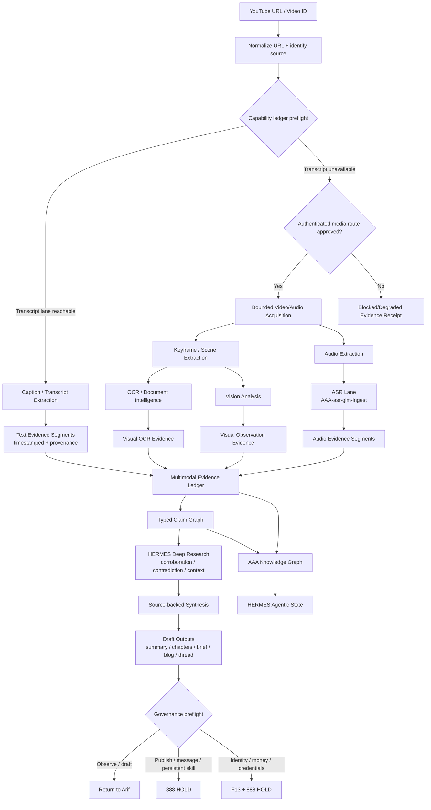

# YouTube Intelligence Graph — HERMES/AAA

> Source: Arif Fazil, 2026-09-12
> DITEMPA BUKAN DIBERI.

## Principle

The durable object is **evidence**, not "a video summary."
A summary is an output view that can be regenerated.
Evidence is what lets HERMES audit, revisit, challenge, and improve the knowledge graph.

## Canonical Flow



## Layer Boundaries

### Intake is not analysis

The intake layer establishes:
- Canonical video URL and ID
- Title/channel/publication metadata, if obtainable
- Retrieval time
- Acquisition route attempted
- Access restrictions or failure reason
- Cryptographic hash of retained local media, where legally and operationally appropriate

A caption is not "knowledge." It is what the video speaker said, at a timestamp.

### Media processing creates evidence

Each modality must remain distinct:

| Modality | Example evidence | Valid claim |
|---|---|---|
| Transcript | "At 04:18, speaker says X" | The speaker made statement X |
| ASR audio | Audio-derived transcript at 04:18–04:27 | Speaker likely said X, subject to ASR confidence |
| OCR | Slide text at 11:42 | Slide displays text/data Y |
| Vision | Diagram/frame observation at 11:42 | Visual feature Z is present |
| Research | External primary source | Claim X/Y can be corroborated or disputed |

Never collapse these into one "video says true."

### Generation is downstream

```
Evidence ledger
→ claim graph
→ reviewed synthesis
→ derivative content plan
→ image/video/TTS generation
→ human review
→ 888 HOLD for publication
```

token-plan-video, token-plan-image, and TTS are outputs.
They must not be treated as sources or reasoning evidence.

## Routing Logic

```
1. Normalize and validate URL/video ID.
2. Check ledger: is YouTube transcript route reachable now?
3. Attempt caption/transcript extraction.
4. If transcript exists and satisfies coverage/quality threshold:
   → create timestamped text evidence.
5. If absent, incomplete, or unsuitable:
   → check whether local authenticated acquisition is approved and reachable.
6. If approved:
   → retrieve audio locally; ASR through AAA-asr-glm-ingest.
7. If visual content is decision-critical:
   → sample frames, OCR/vision them, and create visual evidence segments.
8. If a route fails:
   → store a blocked/degraded evidence record; do not fabricate a summary.
9. Convert evidence to typed claims.
10. Run HERMES research only on claims needing verification.
11. Return a draft output with provenance.
12. Require 888 HOLD for publishing, creating a persistent skill, or external messaging.
```

## HERMES Integration Rules

HERMES should not ingest arbitrary video text directly into memory.
It receives only graph-backed artifacts.

HERMES input:
- video asset identity
- evidence segment IDs
- timestamp anchors
- claim IDs
- corroboration state
- confidence and epistemic labels
- capability/probe status
- receipt / processing run ID

HERMES may:
- retrieve evidence
- summarize with source anchors
- compare claims across videos
- generate a research plan
- propose downstream tasks

HERMES must not:
- turn transcript text into fact without labeling
- silently use browser cookies
- publish, message, or create a persistent skill without 888 HOLD
- claim multimodal perception where only transcript evidence exists

## Evidence Envelope (minimum)

```yaml
video_asset:
  id: "yt:<video_id>"
  canonical_url: "https://www.youtube.com/watch?v=<video_id>"
  title: null
  channel: null
  published_at: null
  retrieved_at: "ISO-8601"
  acquisition_route: "captions | yt_dlp_audio | manual_upload | blocked"
  media_rights_note: "Source reference only; do not assume redistribution rights"
  source_hash: null

evidence_segment:
  id: "ev:<uuid>"
  video_id: "yt:<video_id>"
  modality: "transcript | audio_asr | visual_ocr | visual_observation"
  start_seconds: 0.0
  end_seconds: 0.0
  text: "..."
  extraction_method: "youtube_transcript_api | glm_asr | ocr | vision"
  extraction_version: "..."
  confidence: 0.0
  provenance_url: "canonical URL with timestamp fragment where possible"
  status: "observed | degraded | unavailable | disputed"

claim:
  id: "claim:<uuid>"
  statement: "Atomic, testable proposition"
  claim_type: "fact | quote | interpretation | recommendation"
  subject: "entity ID or literal"
  predicate: "asserts | reports | compares | recommends"
  object: "value or entity ID"
  evidence_refs:
    - "ev:<uuid>"
  time_scope: "video timestamp / publication date / explicitly unknown"
  epistemic_label: "OBS | CLAIM | PLAUSIBLE | HYPOTHESIS | UNKNOWN"
  confidence: 0.0
  corroboration_status: "unreviewed | corroborated | contradicted | insufficient"
  derived_by: "Hermes / AAA pipeline version"
```

**Rule:** a transcript segment is an observation of what was said.
It is not proof that the statement is true.
A downstream factual claim must cite the segment and external corroboration where the content matters.

## Video-to-Skill Procedure Candidate

Video-derived procedure ≠ verified skill.

```yaml
procedure_candidate:
  id: "proc:<uuid>"
  source_video: "yt:<video_id>"
  source_evidence:
    - "ev:<timestamped_segment>"
  purpose: "..."
  preconditions:
    - "..."
  steps:
    - order: 1
      instruction: "..."
      evidence_ref: "ev:<uuid>"
  tools_required:
    - "..."
  risks:
    - "..."
  reversibility: "reversible | mixed | irreversible"
  verification:
    test_case_required: true
    source_independent_corroboration_required: true
  governance:
    state: draft_only
    activation_gate: "888_HOLD"
```

## HERMES State Object

```yaml
hermes_video_context:
  asset_ref: "yt:<video_id>"
  evidence_coverage:
    transcript: true
    audio_asr: false
    visuals: partial
  claims:
    observed_quotes: 14
    factual_claims_pending_check: 6
    corroborated_facts: 3
    interpretations: 5
  quality:
    transcript_coverage_ratio: 0.91
    visual_sampling_coverage_ratio: 0.18
    unresolved_segments: 4
  action_state:
    allowed: "observe_and_draft"
    blocked:
      - "external_publish"
      - "persistent_skill_creation"
  receipt_ref: "video-run:<uuid>"
```
