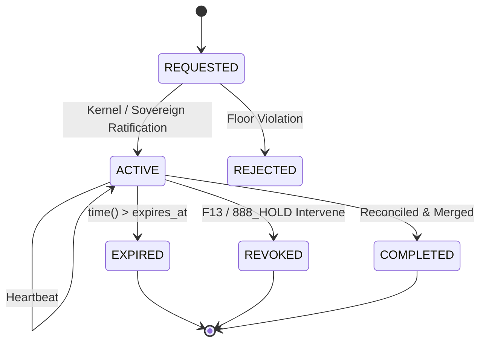

# Path-5 Lease Governance Specification (v1.0)
**Document:** `LEASE_SPEC_V1.md`  
**Standard:** QQQ Protocol · F1 Truth · Adab · Fail Closed  
**Date:** 2026-09-14T09:47:30+08:00  
**Authority:** ARIF (F13 Sovereign Principal) · `ARIFOS::PATH5_OPERATIONALIZATION::v1`

---

## 1. Objective & Invariant

Every mutation in the arifOS federation requires a cryptographically verifiable, time-bounded, scoped Capability Lease.  
**Invariant:** *An agent attempting mutation without an active, unexpired, unrevoked lease matching the targeted file scope must fail closed.*

---

## 2. Lease Data Schema

```json
{
  "lease_id": "lease_8a2b3c4d5e6f",
  "actor_id": "FI-009/AGY",
  "capability": "code_mutation",
  "scope": {
    "repository": "AAA",
    "allowed_paths": ["AAA/path5/*", "AAA/tests/*"],
    "forbidden_paths": ["AAA/secrets/*", "/root/.secrets/*"]
  },
  "ttl_seconds": 3600,
  "issued_at": "2026-09-14T01:47:00Z",
  "expires_at": 1789354020.0,
  "last_heartbeat": 1789350420.0,
  "heartbeat_interval_sec": 300,
  "status": "ACTIVE",
  "revoked": false,
  "revocation_reason": null,
  "signature": "sha256:..."
}
```

---

## 3. Required State Controls

### 3.1 Lifecycle States


### 3.2 Heartbeat Control
- Agents must issue a heartbeat ping at least once every `heartbeat_interval_sec` (default: 300s).
- If `now - last_heartbeat > 2 * heartbeat_interval_sec`, the lease enters `STALE` status and write operations freeze until reconciled.

### 3.3 Expiry Control
- At every validation call, if `now > expires_at`, status transitions instantly to `EXPIRED`.
- Expired leases are immutable and reject all mutation and reconciliation attempts.

### 3.4 Revocation (Emergency Kill)
- F13 or 888_APEX can invoke `revoke(lease_id, reason)` at any time.
- Revocation immediately invalidates the lease, freezes the associated worktree, and notifies FRAME/arifFlow.

---

## 4. Enforcement Rule

Any tool or CLI executing file writes in the swarm mode must validate:
1. `validate(lease_id, target_file)` returns `{"valid": True}`.
2. If invalid: Raise `LeaseViolationError` and refuse write.
