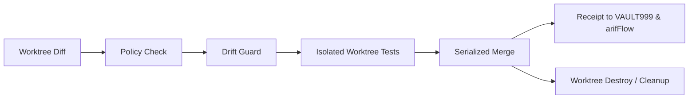

# Path-5 A-FORGE Reconciler Specification (v1.0)
**Document:** `RECONCILER_SPEC.md`  
**Standard:** QQQ Protocol · F1 Truth · Build Senate  
**Date:** 2026-09-14T09:49:30+08:00  
**Authority:** ARIF (F13 Sovereign Principal) · `ARIFOS::PATH5_OPERATIONALIZATION::v1`

---

## 1. Role: The Build Senate

A-FORGE Reconciler is the sole authority permitted to merge code into the canonical repositories. No individual worker agent has direct push or merge authority to `main`.

---

## 2. Six-Stage Verification Pipeline

### Stage 1: Diff & Scope Inspection
- Runs `git diff --name-only <base_branch>...HEAD` in the worktree.
- Reconciles file list against Lease `allowed_paths`. Fail-closed on any out-of-scope modification.

### Stage 2: Policy & Stewardship Check
- Verifies lease is active, unexpired, and unrevoked.
- Confirms modifications match the authorized Domain Steward rules in `DOMAIN_STEWARDSHIP_MAP.md`.

### Stage 3: Drift & Secret Guard
- Scans changed files for secrets, plaintext tokens, or file mode > `600` on sensitive configs.
- Verifies Gate 2d compliance (no sensitive perimeter files touched without sovereign exemption).

### Stage 4: In-Worktree Test Execution
- Executes unit tests directly inside `/root/forge_work/worktrees/<lease_id>`.
- Must achieve 100% PASS on regression suites before advancing to merge.

### Stage 5: Serialized Reconciliation Merge
- Acquires `/root/forge_work/worktrees/.reconcile.lock`.
- Performs `git merge --no-ff swarm/<lease_id> -m "reconcile(swarm): merge <lease_id> from <actor_id>"`.
- Verifies post-merge tree integrity. Releases lock.

### Stage 6: Receipt & Cleanup
- Emits cryptographic receipt containing commit hash, diff summary, test output hash, and lease ID.
- Emits event to `arifFlow` (`:7073/ingest`) and records entry in `receipts.jsonl`.
- Destroys the worktree and cleans up the temporary swarm branch.
