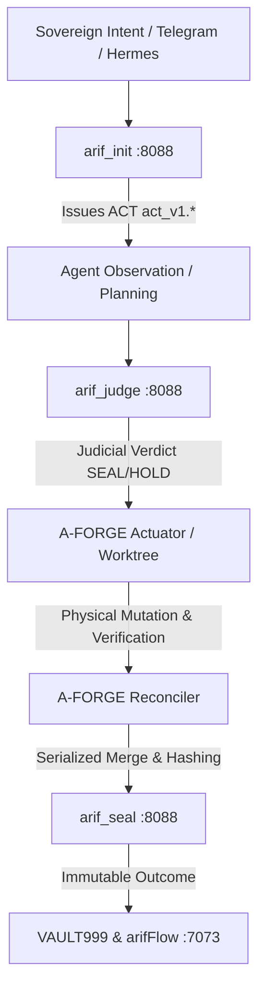

# Federation Flow Map (Phase D)
**Document:** `FLOW_MAP.md`  
**Standard:** QQQ Protocol · Actual Flow Correspondence  
**Date:** 2026-09-14T09:51:00+08:00  
**Authority:** ARIF (F13 Sovereign Principal) · `ARIFOS::ENTROPY_REDUCTION::REALITY_GRAPH::v1`

---

## 1. Canonical Governed Flow

---

## 2. Real-World Execution Flows

### Flow 1: Interactive Chat / Command (Hermes → VPS)
- **Trace:** Arif Telegram DM → OpenClaw/Hermes Gateway (`:18001`) → `mem0` vector search (`:6333`) → LiteLLM (`:4000/:4013`) → Model Response.
- **Classification:** `VALID` (with shadow memory risk).

### Flow 2: Coder Citizen Execution (Antigravity / Kimi / OpenCode)
- **Trace:** Agent CLI → `arif_init` (ACT generated) → `path5_engine` (Lease issued) → Worktree created (`/root/forge_work/worktrees/<lease>`) → In-worktree mutations → Reconciler verification → Base merge → `receipts.jsonl`.
- **Classification:** `VALID` (Path-5 living substrate).

### Flow 3: LLM Model Fallback Chain
- **Trace:** User Request → LiteLLM (:4000) → Rung 1 (Gemini - 429) → Rung 2 (Mistral - 402) → Rung 3 (Z.AI - 429) → Rung 4 (Qwen - 429) → MiniMax / DeepSeek (HTTP 200).
- **Classification:** `DEGRADED / HIGH_LATENCY` (4 failed upstream rungs before success).
