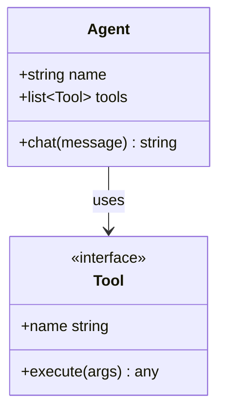
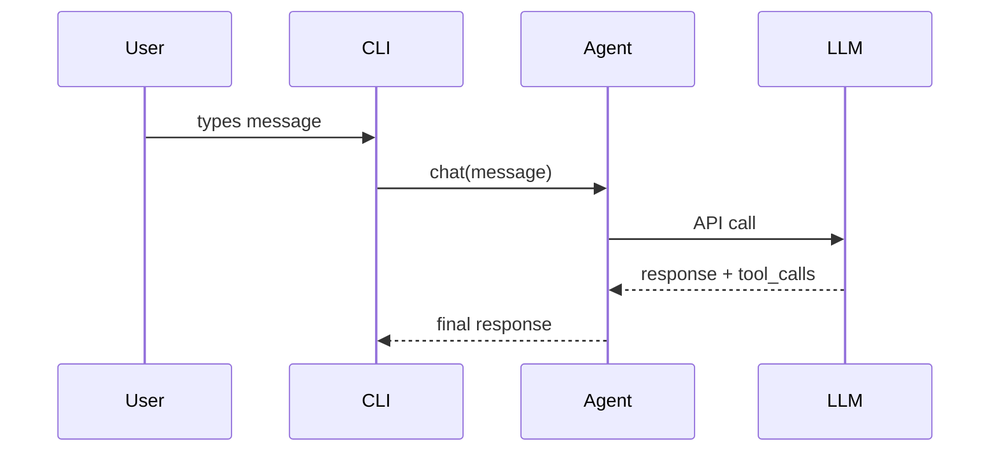

# Code Wiki — Codebase Documentation Generator

## Overview

This skill produces a comprehensive reference wiki for any codebase. It creates a project overview, architecture narrative, per-module deep-dives, getting-started guide, and Mermaid class/sequence diagrams. The output is **reference documentation** (what the code does and how) — not strategic narrative (why it exists).

## arifOS-ACT Embedding

Before using this skill on any mutating, irreversible, or high-blast-radius task:
1. **ART** — Attune (what is the real task?), Recognize (what class of power?), Test (fit · authority · evidence · blast · reversible).
2. **Kernel** — Route to arifOS for F1–F13 judgment if action class is Maker/Messenger/Mutator/Destroyer/Sovereign.
3. **ACT** — Apply narrow, Constrain scope, Trace witness, STOP before corruption.
4. **Receipt** — Leave evidence of what changed, why, and under whose authority.

## When to Use

- The user asks to "document this codebase", "generate a wiki", "make architecture diagrams", or "map this repo".
- You are onboarding an unfamiliar codebase and need a structured module map.
- The codebase has many modules and a single README is insufficient.
- You need Mermaid diagrams that faithfully represent source structure.

## When NOT to Use

- **Single-file or single-function documentation** — answer directly instead.
- **One specific API endpoint reference** — use inline file reads.
- **Strategic "why does this exist" narrative** — this skill documents structure, not purpose.
- **Codebases you are actively developing** — document incrementally as questions arise.
- **Highly confidential codebases** — escalate if the repository contains secrets or PII.

## Inputs

| Input | Required | Description |
|-------|----------|-------------|
| repo_path or GitHub URL | yes | Local path or cloneable repository URL |
| output_name | no | Directory name under `~/.codex/wikis/` (defaults to repo basename) |
| module_limit | no | Maximum modules to document (default: 8–10) |
| include_api_doc | no | Set true if the project is a library/API server |

## Procedure

### Step 1: Resolve Target

For a local path, record the repo SHA and name:
```bash
cd <path>
REPO_SHA=$(git rev-parse HEAD 2>/dev/null || echo "uncommitted")
REPO_NAME=$(basename "$PWD")
```

For a GitHub URL, clone to a temp directory:
```bash
WIKI_TMP=$(mktemp -d)
git clone --depth 50 <url> "$WIKI_TMP/repo"
cd "$WIKI_TMP/repo"
REPO_SHA=$(git rev-parse HEAD)
REPO_NAME=$(basename <url> .git)
```

Create the output structure:
```bash
OUTPUT_DIR="$HOME/.codex/wikis/$REPO_NAME"
mkdir -p "$OUTPUT_DIR/modules" "$OUTPUT_DIR/diagrams"
```

### Step 2: Scan Repository Structure

Run a shallow, filtered scan:
```bash
find . -type d \
  -not -path '*/\.*' \
  -not -path '*/node_modules*' \
  -not -path '*/venv*' \
  -not -path '*/__pycache__*' \
  -not -path '*/dist*' \
  -not -path '*/build*' \
  -not -path '*/target*' \
  -maxdepth 3 | sort
```

Optionally collect language stats:
```bash
pygount --format=summary \
  --folders-to-skip=".git,node_modules,venv,.venv,__pycache__,.cache,dist,build,target" \
  . 2>/dev/null || true
```

Read the relevant manifest files (`package.json`, `pyproject.toml`, `Cargo.toml`, `go.mod`, etc.) and `README.md`.

### Step 3: Select Modules to Document

Use language-specific heuristics:
- **Python:** top-level packages (dirs with `__init__.py`)
- **JS/TS:** `src/<subdir>` or top-level workspace dirs
- **Rust:** workspace crates or `src/<module>` dirs
- **Go:** top-level package directories

Prioritize by import count, LOC, and README mentions. Cap the list at 8–10 modules unless the user expands scope. State the selected modules before generating docs.

### Step 4: Write README.md

```markdown
# <Project Name>

<One paragraph: what it is and what it's for.>

## Key Concepts
- **<Concept>** — <one line>

## Entry Points
- [`path/to/main.py`](link) — <what runs when started>

## High-Level Architecture
<2–3 sentences pointing to architecture.md.>

## Module Map
| Module | Purpose |
|---|---|
| [`<module>`](link) | <one-line purpose> |
```

### Step 5: Write architecture.md

Include:
- 2–3 paragraphs describing system shape and component interactions.
- A `flowchart TD` Mermaid diagram using `[]` for components, `[()]` for storage, `{{}}` for external services, and `(())` for entry points.
- A numbered data-flow walkthrough linking to source files.
- A note that `-->` = sync call and `-.->` = async/event.

### Step 6: Write Per-Module Docs

For each selected module, read 3–5 key files, then produce:
```markdown
# Module: `<module>`

<1–2 sentence purpose.>

## Responsibilities
- <bullet>

## Key Files
- [`<module>/<file>`](link) — <what it does>

## Public API
<Functions/classes used by other code, with signatures.>

## Dependencies
- **Used by:** <other modules>
- **Uses:** <other modules + external libs>
```

### Step 7: Write diagrams/class-diagram.md

Pick 5–10 important classes/types and diagram them:
```markdown
# Class Diagram

## Core Types

```

For Go/Rust without classes, diagram struct relationships or explain in prose.

### Step 8: Write diagrams/sequences.md

Pick 2–4 key workflows and trace call paths:
```markdown
# Sequence Diagrams

## Workflow: <Name>


### Walkthrough
1. **User input** — [`cli.py:HermesCLI.run_session`](link)
```

### Step 9: Write getting-started.md

Include prerequisites, installation commands, first-run command, common workflows, and configuration files.

### Step 10: Write api.md (Conditional)

Only if the project is a library or API server. Document the public API surface.

### Step 11: Write .codewiki-state.json

```bash
cat > "$OUTPUT_DIR/.codewiki-state.json" <<'EOF'
{
  "repo_name": "$REPO_NAME",
  "source_path": "$PWD",
  "source_sha": "$REPO_SHA",
  "generated_at": "$(date -u +%Y-%m-%dT%H:%M:%SZ)",
  "generator": "code-wiki skill",
  "modules_documented": []
}
EOF
```

### Step 12: Verify and Report

Verify expected files and balanced Mermaid fences:
```bash
ls "$OUTPUT_DIR"/{README.md,architecture.md,getting-started.md,.codewiki-state.json}
for f in "$OUTPUT_DIR"/diagrams/*.md "$OUTPUT_DIR"/architecture.md; do
  opens=$(grep -c '^```mermaid' "$f")
  total=$(grep -c '^```' "$f")
  echo "$f: $opens mermaid blocks, $total total fences"
done
```

Report the generated wiki path and contents to the user. If cloned to temp, remind them it can be removed after review.

## Allowed Tools

| Tool / Capability | Purpose |
|---|---|
| `read_file` | Inspect manifests, README, and key source files |
| `search_files` | Locate modules, classes, and call paths without reading entire files |
| `Bash` / shell | Run filtered tree scans, pygount, and git commands |
| `Write` | Emit wiki files to `~/.codex/wikis/<repo-name>/` |
| `mcporter` (if available) | Pull federation context for cross-organ repos |

## Forbidden Actions

- **NEVER** fabricate components, functions, or relationships not present in the source.
- **NEVER** exceed 50 nodes in a single Mermaid diagram — split into sub-diagrams.
- **NEVER** document vendored, generated, or third-party code (e.g., `_pb2.py`, `.min.js`, `node_modules/`).
- **NEVER** use `%%{init: ...}%%` Mermaid theme blocks — GitHub Mermaid theme is fixed.
- **NEVER** skip verification of Mermaid fence balance before reporting completion.
- **NEVER** expose secrets, credentials, or PII discovered during documentation.
- Escalate to **arifOS 888_JUDGE** if the codebase contains unredacted secrets or constitutional files are affected.

## Output Format

```
## Skill Result: code-wiki

### Summary
Generated a structured wiki for <repo-name> at ~/.codex/wikis/<repo-name>/, including overview, architecture, module deep-dives, getting-started guide, and Mermaid diagrams.

### Evidence
- Source repo: <path-or-url>
- Source SHA: <commit-sha>
- Modules documented: <list>
- Files created: README.md, architecture.md, getting-started.md, modules/<N>, diagrams/class-diagram.md, diagrams/sequences.md, .codewiki-state.json
- Mermaid blocks verified: <count>

### Recommendations
- Review module selection for correctness.
- If cloned to temp, remove the temp directory after review.
- Re-run if the user expands scope beyond the default 8–10 modules.

### Escalations
- None / <list if secrets or constitutional impact found>
```

## Escalation Path

| Condition | Escalate To | Method |
|-----------|-------------|--------|
| Secrets or credentials found in source | security.agent + arifOS judge | A2A message / 888 HOLD |
| Constitutional files affected | arifOS 888_JUDGE | A2A verdict_request |
| User requests exhaustive scope beyond T1 | Arif (human) | confirm before proceeding |

---

*Skill version 1.0.0 — AAA Skill Library*
